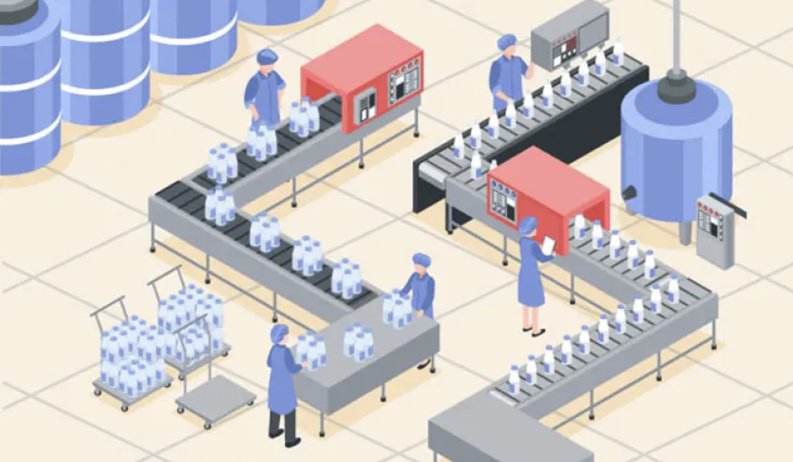
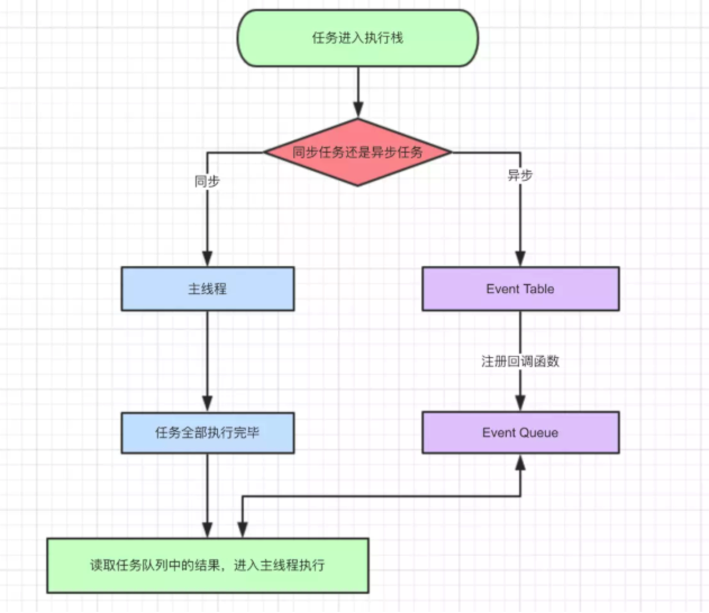

> javascript是一门单线程语言
> Event Loop是javascript的执行机制

## 线程 与 进程


计算机的核心是`CPU`，它承担了所有的计算任务。
它就像`一座工厂`，时刻在运行。


假定工厂的电力有限，一次只能供给一个车间使用。
也就是说，一个车间开工的时候，其他车间都必须停工。
背后的含义就是，单个CPU一次只能运行一个任务。

`进程`就好比`工厂的车间`，它代表CPU所能处理的单个任务。
进程之间相互独立，任一时刻，CPU总是运行一个进程，其他进程处于非运行状态。
CPU使用时间片轮转进度算法来实现同时运行多个进程。



一个车间里，可以有很多工人，共享车间所有的资源，他们协同完成一个任务。
`线程`就好比`车间里的工人`，`一个进程可以包括多个线程`，多个线程共享进程资源。


从上文我们已经简单了解了**CPU、进程、线程**，简单汇总一下。

> 进程是cpu资源分配的最小单位（是能拥有资源和独立运行的最小单位）
> 线程是cpu调度的最小单位（线程是建立在进程的基础上的一次程序运行单位，一个进程中可以有多个线程）
> 不同进程之间也可以通信，不过代价较大
> 单线程与多线程，都是指在一个进程内的单和多


## 浏览器的进程

浏览器包含了哪些进程

**主进程**
协调控制其他子进程（创建、销毁）
浏览器界面显示，用户交互，前进、后退、收藏
将渲染进程得到的内存中的Bitmap，绘制到用户界面上
处理不可见操作，网络请求，文件访问等

**第三方插件进程**
每种类型的插件对应一个进程，仅当使用该插件时才创建

**GPU进程**用于3D绘制等

**渲染进程**，就是我们说的**浏览器内核**
负责页面渲染，脚本执行，事件处理等
每个tab页一个渲染进程

那么浏览器中包含了这么多的进程，那么对于普通的前端操作来说，最重要的是什么呢？
答案是`渲染进程`，也就是我们常说的`浏览器内核`

## 浏览器内核（渲染进程）

从前文我们得知，进程和线程是一对多的关系，也就是说一个进程包含了多条线程。

而对于`渲染进程`来说，它当然也是多线程的了，接下来我们来看一下渲染进程包含哪些线程。


`GUI渲染线程`

负责渲染页面，布局和绘制
页面需要重绘和回流时，该线程就会执行
与js引擎线程互斥，防止渲染结果不可预期


`JS引擎线程`

负责处理解析和执行javascript脚本程序
只有一个JS引擎线程（单线程）
与GUI渲染线程互斥，防止渲染结果不可预期


`事件触发线程`

用来控制事件循环（鼠标点击、setTimeout、ajax等）
当事件满足触发条件时，将事件放入到JS引擎所在的执行队列中


`定时触发器线程`

setInterval与setTimeout所在的线程
定时任务并不是由JS引擎计时的，是由定时触发线程来计时的
计时完毕后，通知事件触发线程


`异步http请求线程`

浏览器有一个单独的线程用于处理AJAX请求
当请求完成时，若有回调函数，通知事件触发线程

### 为什么 javascript 是单线程的

首先是历史原因，在创建 javascript 这门语言时，多进程多线程的架构并不流行，硬件支持并不好。
其次是因为多线程的复杂性，多线程操作需要加锁，编码的复杂性会增高。
而且，如果同时操作 DOM ，在多线程不加锁的情况下，最终会导致 DOM 渲染的结果不可预期。

### 为什么 GUI 渲染线程与 JS 引擎线程互斥

这是由于 JS 是可以操作 DOM 的，如果同时修改元素属性并同时渲染界面(即 JS线程和UI线程同时运行)，
那么渲染线程前后获得的元素就可能不一致了。
因此，为了防止渲染出现不可预期的结果，浏览器设定 GUI渲染线程和JS引擎线程为互斥关系，
当JS引擎线程执行时GUI渲染线程会被挂起，GUI更新则会被保存在一个队列中等待JS引擎线程空闲时立即被执行。

## 从 Event Loop 看 JS 的运行机制

观察下面代码的执行顺序
```
    console.log(1)
    
    setTimeout(function(){
        console.log(2)
    }，0)

    console.log(3)
```
    
运行结果是: 1 3 2

也就是说，setTimeout里的函数并没有立即执行，而是延迟了一段时间，满足一定条件后，才去执行的，这类代码，我们叫异步代码。
所以，这里我们首先知道了JS里的一种分类方式，就是将任务分为: 同步任务和异步任务



导图要表达的内容用文字来表述的话：

同步和异步任务分别进入不同的执行"场所"，同步的进入主线程，异步的进入Event Table并注册函数。
当指定的事情完成时，Event Table会将这个函数移入Event Queue。
主线程内的任务执行完毕为空，会去Event Queue读取对应的函数，进入主线程执行。
上述过程会不断重复，也就是常说的Event Loop(事件循环)。

我们不禁要问了，那怎么知道主线程执行栈为空啊？js引擎存在monitoring process进程，会持续不断的检查主线程执行栈是否为空，一旦为空，就会去Event Queue那里检查是否有等待被调用的函数。


> 不管是`setTimeout/setInterval`和`XHR/fetch`代码，在这些代码执行时，本身是同步任务，而其中的回调函数才是异步任务。
> 当代码执行到`setTimeout/setInterval`时，实际上是`JS引擎线程`通知定时`触发器线程`，间隔一个时间后，会触发一个回调事件，而`定时触发器线程`在接收到这个消息后，会在等待的时间后，将回调事件放入到由`事件触发线程`所管理的`事件队列`中。
> 当代码执行到XHR/fetch时，实际上是`JS引擎线程`通知`异步http请求线程`，发送一个网络请求，并制定请求完成后的回调事件，而异步`http请求线程`在接收到这个消息后，会在请求成功后，将回调事件放入到由`事件触发线程`所管理的`事件队列`中。
> 当我们的同步任务执行完，`JS引擎线程`会询问`事件触发线程`，在`事件队列`中是否有待执行的回调函数，如果有就会加入到执行栈中交给`JS引擎线程`执行


我们猜测JS的执行机制是

* 首先判断JS是同步还是异步，同步就进入主线程，异步就进入event table
* 异步任务在event table中注册函数，当满足触发条件后，被推入event queue
* 同步任务进入主线程后一直执行，直到主线程空闲时，才会去event 

queue中查看是否有可执行的异步任务，如果有就推入主线程中。以上三步循环执行，这就是event loop。

但是再看下面这段代码

```
 setTimeout(function(){
     console.log('定时器开始啦')
 });
 
 new Promise(function(resolve){
     console.log('马上执行for循环啦');
     for(var i = 0; i < 10000; i++){
         i == 99 && resolve();
     }
 }).then(function(){
     console.log('执行then函数啦')
 });
 
 console.log('代码执行结束');
```
 
尝试按照上文猜测的JS执行机制去分析，结果应该是 【马上执行for循环啦 --- 代码执行结束 --- 定时器开始啦 --- 执行then函数啦

亲自执行后，结果却是【马上执行for循环啦 --- 代码执行结束 --- 执行then函数啦 --- 定时器开始啦】

## 宏任务 和 微任务

除了广义的同步任务和异步任务，我们对任务有更精细的定义：

* macro-task(宏任务)：包括整体代码script，setTimeout，setInterval
* micro-task(微任务)：Promise，process.nextTick

不同类型的任务会进入对应的Event Queue，比如setTimeout和setInterval会进入相同的Event Queue。
process.nextTick(callback)类似node.js版的"setTimeout"

事件循环的顺序，决定js代码的执行顺序。进入整体代码(宏任务)后，开始第一次循环。接着执行所有的微任务。然后再次从宏任务开始，找到其中一个任务队列执行完毕，再执行所有的微任务。

们前文提到过JS引擎线程和GUI渲染线程是互斥的关系，浏览器为了能够使宏任务和DOM任务有序的进行，会在一个宏任务执行结果后，在下一个宏任务执行前，GUI渲染线程开始工作，对页面进行渲染。

所以，宏任务-->微任务-->渲染-->宏任务-->微任务-->渲染．．

## setTimeout的意思

这段setTimeout代码什么意思? 我们一般说: 3秒后，会执行setTimeout里的那个函数
```
 setTimeout(function(){
    console.log('执行了')
 }，3000)    
```
但是这种说并不严谨，准确的解释是: 3秒后，setTimeout里的函数被会推入event queue，而event queue(事件队列)里的任务，只有在主线程空闲时才会执行。
所以只有满足 (1)3秒后 (2)主线程空闲，同时满足时，才会3秒后执行该函数
如果主线程执行内容很多，执行时间超过3秒，比如执行了10秒，那么这个函数只能10秒后执行了

## 写在最后

### js的异步

我们从最开头就说javascript是一门单线程语言，不管是什么新框架新语法糖实现的所谓异步，其实都是用同步的方法去模拟的，牢牢把握住单线程这点非常重要。

### 事件循环Event Loop

事件循环是js实现异步的一种方法，也是js的执行机制。

### javascript的执行和运行

执行和运行有很大的区别，javascript在不同的环境下，比如node，浏览器，Ringo等等，执行方式是不同的。而运行大多指javascript解析引擎，是统一的。

### setImmediate

微任务和宏任务还有很多种类，比如setImmediate等等，执行都是有共同点的，有兴趣的同学可以自行了解。

### 最后的最后
javascript是一门单线程语言
Event Loop是javascript的执行机制


## 例子

```js
document.body.style = 'background:black';
document.body.style = 'background:red';
document.body.style = 'background:blue';
document.body.style = 'background:grey';
```
我们会看到的结果是，页面背景会在瞬间变成灰色，以上代码属于同一次宏任务，所以全部执行完才触发页面渲染，渲染时GUI线程会将所有UI改动优化合并，所以视觉效果上，只会看到页面变成灰色。

```js
document.body.style = 'background:blue';
setTimeout(function(){
    document.body.style = 'background:black'
},0)
```
我会看到，页面先显示成蓝色背景，然后瞬间变成了黑色背景，这是因为以上代码属于两次宏任务，第一次宏任务执行的代码是将背景变成蓝色，然后触发渲染，将页面变成蓝色，再触发第二次宏任务将背景变成黑色。

```js
document.body.style = 'background:blue'
console.log(1);
Promise.resolve().then(()=>{
    console.log(2);
    document.body.style = 'background:black'
});
console.log(3);
```

控制台输出 1 3 2 , 是因为 promise 对象的 then 方法的回调函数是异步执行，所以 2 最后输出
页面的背景色直接变成黑色，没有经过蓝色的阶段，是因为，我们在宏任务中将背景设置为蓝色，但在进行渲染前执行了微任务，
在微任务中将背景变成了黑色，然后才执行的渲染

```js
setTimeout(() => {
    console.log(1)
    Promise.resolve(3).then(data => console.log(data))
}, 0)

setTimeout(() => {
    console.log(2)
}, 0)
```

上面代码共包含两个 setTimeout ，也就是说除主代码块外，共有两个宏任务，
其中第一个宏任务执行中，输出 1 ，并且创建了微任务队列，所以在下一个宏任务队列执行前，
先执行微任务，在微任务执行中，输出 3 ，微任务执行后，执行下一次宏任务，执行中输出 2


## 练习题

**练习1**

```
console.log('======== main task start ========'); // 1
new Promise(resolve => {
    console.log('create micro task 1'); // 2
    resolve();
}).then(() => {
    console.log('micro task 1 callback'); // 微1.1 6
    setTimeout(() => {
        console.log('macro task 3 callback'); // 宏2 12
    }, 0);
})

console.log('create macro task 2'); // 3
setTimeout(() => { // 宏1
    console.log('macro task 2 callback'); // 8
    new Promise(resolve => {
        console.log('create micro task 3'); // 9
        resolve();
    }).then(() => {
        console.log('micro task 3 callback'); // 微1.3 11
    })
    console.log('create macro task 4'); // 10
    setTimeout(() => {
      console.log('macro task 4 callback'); // 宏3 13
    }, 0);
}, 0);

new Promise(resolve => {
  console.log('create micro task 2'); // 4
  resolve();
}).then(() => {
  console.log('micro task 2 callback'); // 微1.2 7
})

console.log('======== main task end ========'); // 5
```

**练习2**

```
async function async1() {
    console.log('async1 start') // 2
    await async2()
    console.log('async1 async2') // 微1.1 6
    await async3()
    console.log('async1 async3') // 微1.3 9
    const a = await async4()
    console.log(a)
}

async function async2() {
    console.log('async2') // 3 
}
async function async3() {
    console.log('async3') // 7 
}
async function async4() {
    console.log('async4') // 10 
    return new Promise(resolve => {
        setTimeout(() => resolve('async4 setTimeout'), 0) // 12 
    })
}

console.log('script start') // 1 

setTimeout(function() { // 宏1
    console.log('setTimeout') // 11
}, 0)

async1()

new Promise(function(resolve) {
    console.log('promise1') // 4 
    resolve()
}).then(function() {
    console.log('promise2') // 微1.2 8 
})

console.log('script end') // 5
```

**练习3**

```
console.log('1'); // 1

setTimeout(function() { // 宏1
    console.log('2'); // 5 
    process.nextTick(function() { // 微2.1
        console.log('3'); // 9 
    })
    new Promise(function(resolve) {
        console.log('4'); // 6 
        resolve();
    }).then(function() {
        console.log('5') //微2.2 10
    })
})
process.nextTick(function() { // 微1.1 3
    console.log('6');
})
new Promise(function(resolve) {
    console.log('7'); // 2
    resolve();
}).then(function() {
    console.log('8') // 微1.2 4
})

setTimeout(function() { // 宏2
    console.log('9'); // 7
    process.nextTick(function() { // 微2.3
        console.log('10');  // 11
    })
    new Promise(function(resolve) {
        console.log('11'); // 8
        resolve();
    }).then(function() {
        console.log('12') // 微2.4 12
    })
})
```

**练习4**

```
async function async1() {
    console.log( 'async1 start' )
    await async2()
    console.log( 'async1 end' )
}
async function async2() {
    console.log( 'async2' )
}
console.log( 'script start' )
setTimeout( function () {
    console.log( 'setTimeout' )
}, 0 )
async1();
new Promise( function ( resolve ) {
    console.log( 'promise1' )
    resolve();
} ).then( function () {
    console.log( 'promise2' )
} )
console.log( 'script end' )
```

**答案**

练习1: 
======== main task start ========
create micro task 1
create macro task 2
create micro task 2
======== main task end ========
micro task 1 callback
micro task 2 callback
macro task 2 callback
create micro task 3
create macro task 4
macro task 3 callback
micro task 3 callback
macro task 4 callback


练习2:
script start
async1 start
async2
promise1
script end
async1 async2
async3
promise2
async1 async3
async4
setTimeout
async4 setTimeout

练习3：
1
7
6
8
2
4
9
11
3
10
5
12

练习4:
script start
async1 start
async2
promise1
script end
async1 end
promise2
setTimeout