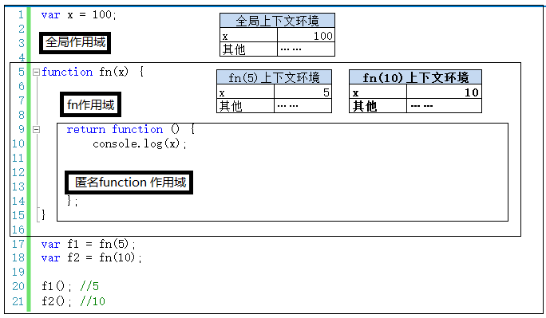

许多开发人员经常混淆作用域和执行上下文的概念，误以为他们是相同的概念，但并非如此

我们知道javascript属于解释性语言，javascript的执行分为：解释和执行两个阶段，这两个阶段所做的事是不一样的

**解释阶段：**
- 词法分析
- 语法分析
- 作用域规则确定

**执行阶段**
- 创建执行上下文（也可以理解为执行前的“准备工作”）
- 执行函数代码
- 垃圾回收

js解释阶段便会确定解释规则，因此`作用域在函数定义时就已经确定了`，而不是在函数调用时确定，但是`执行上下文是在函数执行之前（调用时）创建的`
执行上下文最明显的就是this的指向是执行时确定的，而作用域访问的变量是编写代码的结构确定的

作用域和执行上下文之间最大的区别是：执行上下文在运行时确定，随时都可能改变；作用域在定义时确定，不会改变

除此之外

上下文环境可以理解为一个看不见但实际存在的对象，所有变量都在里存着（所以在调用时创建就很好理解了，拿参数做例子，你不调用函数，我怎么知道你要给我传什么参数？）

而作用域比较抽象，创建一个函数就创建了一个作用域，无论你调用不调用，函数只要创建了，它就有独立的作用域，就有自己的一个“地盘”

**`一个作用域下可能包含若干个上下文环境；也有可能从来没有上下文环境（函数未被调用执行）；也有可能有过，但是函数执行后，上下文环境被销毁了`**

