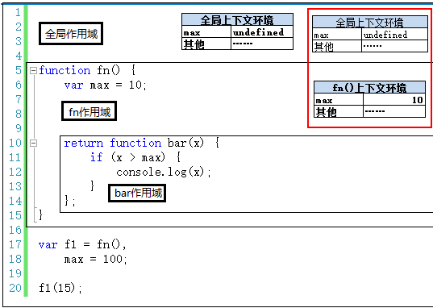

## 一、闭包的定义

> 官方定义：

> 闭包就是能够读取其他函数内部变量的函数。
> 例如在javascript中，只有函数内部的子函数才能读取局部变量，所以闭包可以理解成“定义在一个函数内部的函数“。
> 在本质上，闭包是将函数内部和函数外部连接起来的桥梁。

> 闭包是JS语言的一种特性，闭包通常是一个`函数`
> 函数是一个独立的作用域，独利的作用域外部环境无法访问，就是`闭`
> 封闭自己的词法作用域，函数有许多特殊形式的函数，这就成就了`包`

## 二、为什么要使用闭包

> **先介绍一下全局变量和局部变量的优缺点**
> **全局变量：** 可以重用、但是会造成全局污染而且容易被篡改。
> **局部变量：** 仅函数内使用不会造成全局污染也不会被篡改、不可以重用。
> 所以，全局变量和局部变量的优缺点刚好相对。闭包的出现正好结合了全局变量和局部变量的优点。

闭包最大用处有两个：一个是可以读取函数内部的变量，另一个就是让这些变量的值始终保持在内存中。
总之，`希望重用一个对象，但是又保护对象不被污染篡改时`，就需要使用闭包了。

## 三、闭包的表现形式

可以理解为，能够引用外部函数的成员变量，那它就一定是闭包

- 函数作为返回值
- 函数作为参数传递
- 回调函数
- 非典型闭包IIFE(立即执行函数表达式)

### 1. 函数作为返回值

```js
function fn() {
  var max = 10
  return function bar (x) {
    if (x > max) {
      console.log(x)
    }
  }
}
var f1 = fn()
f1(15)
```

### 2. 函数作为参数传值
无论通过何种手段将内部函数传递到它所在词法作用域之外，它都会持有对原始作用域的引用，无论在何处执行这个函数，都会产生闭包。
```js
const a = 1
function bar(fn) {
  fn()
}
function foo() {
  const a = 2
  function baz() {
    console.log(a)
  }
  bar(baz)
}
foo() // 2
```

自由变量跨作用域取值时，曾经强调过：要去创建这个函数的作用域取值，而不是“父作用域”。理解了这一点，以上两端代码中，自由变量如何取值应该比较简单。

另：如果想要访问全局作用域的a，需要改为下面的代码

```js
const a = 1
function bar(fn) {
  fn(a)
}
function foo() {
  const a = 2
  function baz(x) {
    console.log(x)
  }
  bar(baz)
}
foo() // 1
```

### 3. 回调函数

在定时器、事件监听、Ajax请求、跨窗口通信、Web Workers或者任何异步中，只要使用了回调函数，实际上就是在使用闭包

```js
//定时器
setTimeout(function timeHandler(){
    console.log('timer');
},100)

//事件监听
$('#container').click(function(){
    console.log('DOM Listener');
})
```

### 4. IIFE

IIFE(立即执行函数表达式)并不是一个典型的闭包，但它确实创建了一个闭包。

```js
var a = 2;
(function IIFE(){
  // 输出2
  console.log(a);
})();
```

## 四、经典的6个6 for循环代码题

```js
for(var i = 1; i <= 5; i ++){
  setTimeout(function timer(){
    console.log(i)
  }, 0)
}
```
为什么会全部输出6？如何改进，让它输出1，2，3，4，5？(方法越多越好)

**方法1**：利用`IIFE（立即执行函数表达式）`当每次for循环时，把此时的i变量传递到定时器中
```js
for(var i=1;i<=5;i++){
  (function(j){
    setTimeout(function timer(){
      console.log(j)
    },0)
  })(i)
}
```

**方法2**：`setTimeout函数的第三个参数`，可以作为定时器执行时的变量进行使用
```js
for(var i=1;i<=5;i++){
  setTimeout(function timer(j){
    console.log(j)
  }, 0, i)
}
```

**方法3**：在循环中使用`let i`代替var i
```js
for(let i=1;i<=5;i++){
  setTimeout(function timer(){
    console.log(i)
  }, 0)
}

```

## 五、闭包和执行上下文

**1. 代码执行前生成全局上下文环境，并在执行时对其中的变量进行赋值。此时全局上下文环境是活动状态。**


**2. 执行第17行代码时，调用fn()，产生fn()执行上下文环境，压栈，并设置为活动状态，执行fn，给max赋值**


**3. 执行完第17行，fn()调用完成。按理说应该销毁掉fn()的执行上下文环境，但是这里不能这么做。注意，重点来了：因为执行fn()时，`返回的是一个函数。函数的特别之处在于可以创建一个独立的作用域`。而正巧合的是，返回的这个函数体中，还有一个自由变量max要引用fn作用域下的fn()上下文环境中的max。因此，这个max不能被销毁**

因此，这里的fn()上下文环境不能被销毁，还依然存在与执行上下文栈中。

**4. 执行到第18行，全局上下文环境将变为活动状态，但是fn()上下文环境依然会在执行上下文栈中**


**5. 执行到第20行，执行f1(15)，即执行bar(15)，创建bar(15)上下文环境，并将其设置为活动状态**


这里的重点就在于，创建bar函数是在执行fn()时创建的。fn()早就执行结束了，但是fn()执行上下文环境还存在与栈中，因此bar(15)时，max可以查找到。如果fn()上下文环境销毁了，那么max就找不到了。

`使用闭包会增加内容开销`，现在很明显了吧！

## 六、闭包形成的原因

```js
var count = 10
function add() {
  var count = 0
  return function() {
    count++
    console.log(count)
  }
}
var closure = add()
closure() // 1
closure() // 2
```

### 第一阶段
1. 在内存中创建执行环境栈
2. 在执行环境栈中首先加载浏览器主函数的调用，主函数引用着全局作用域对象window
3. 定义变量


## 七、闭包的应用
