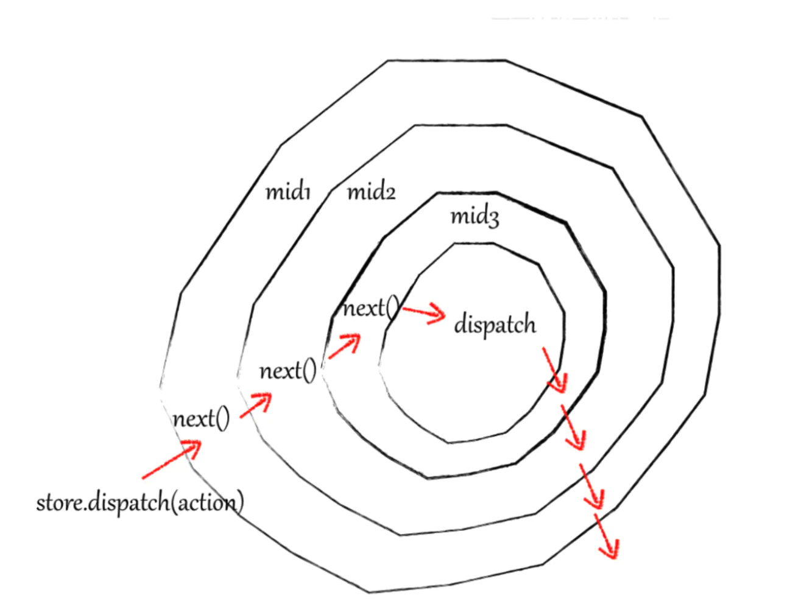

## redux Middleware实现

所谓中间件，我们可以理解为拦截器，用于对某些过程进行拦截和处理，且中间件之间能够串联使用。在redux中，我们中间件拦截的是dispatch提交到reducer这个过程（位于 action 被发起之后，到达 reducer 之前的扩展点），从而增强dispatch的功能。


middleware 最优秀的特性就是可以被链式组合。你可以在一个项目中使用多个独立的第三方 middleware。
你所使用的任何 middleware 都可以以自己的方式解析你 dispatch 的任何内容，并继续传递 actions 给下一个 middleware。

但当 middleware 链中的最后一个 middleware 开始 dispatch action 时，这个 action 必须是一个普通对象。这是同步式的 Redux 数据流 开始的地方（注：这里应该是指，你可以使用任意多异步的 middleware 去做你想做的事情，但是需要使用普通对象作为最后一个被 dispatch 的 action ，来将处理流程带回同步方式）。

下面我们以一个记录日志的中间件为例，一步一步分析redux中间件的设计实现。

我们思考一下，如果我们想在每次dispatch之后，打印一下store的内容，我们会如何实现呢：

### 1. 在每次dispatch之后手动打印store的内容

```js
store.dispatch({ type: 'plus' })
console.log('next state', store.getState())
```

这是最直接的方法，虽然这样做达到了想要的效果，但是你并不想每次都这么干，我们至少要把这部分功能提取出来。

### 2. 封装公共 dispatchAction 方法

```js
function dispatchAndLog(store, action) {    
  store.dispatch(action)    
  console.log('next state', store.getState())
}
```

你可以选择到此为止，但是每次都要导入一个外部方法总归还是不太方便。

### 3. Monkeypatching Dispatch - 替换dispatch方法

> Monkeypatch是什么？
> 根据在网上的搜索，应该是python中常用的技巧 -- 猴子补丁，属性在运行时的动态替换
> 主要用处是：在运行时替换方法、属性等；在不修改第三方代码的情况下增加原来不支持的功能
> 猴子补丁的起源？
> 《松本行弘的程序世界》这本书里面专门有一章讲了猴子补丁的设计：所谓的猴子补丁的含义是指在动态语言中，不去改变源码而对功能进行追加和变更。猴子补丁的这个叫法起源于Zope框架，大家在修正Zope的Bug的时候经常在程序后面追加更新部分，这些被称作是“杂牌军补丁(guerilla patch)”，后来guerilla就渐渐的写成了gorllia(猩猩)，再后来就写了monkey(猴子)，所以猴子补丁的叫法是这么莫名其妙的得来的。

```js
let next = store.dispatch
store.dispatch = function dispatchAndLog(action) {  
  let result = next(action)  
  console.log('next state', store.getState())  
  return result
}
```

如果我们直接把dispatch给替换，这样每次使用的时候不就不需要再从外部引用一次了吗？
对于单纯打印日志来说，这样就足够了。
但是如果我们还有一个监控dispatch错误的需求呢？
我们当然可以在打印日志的代码后面加上捕获错误的代码，但随着功能模块的增多，代码量会迅速膨胀，以后这个中间件就没法维护了，我们希望不同的功能是独立的可拔插的模块。

### 4. 模块化

```js
function patchStoreToAddLogging (store) {
  let next = store.dispatch
  store.dispatch = (action) => {
    let result = next(action)  
    console.log('next state', store.getState())
    return result
  } 
}

function patchStoreToAddCrashReporting (store) {
  let next = store.dispatch
  store.dispatch = (action) => {
    try {            
      return next(action)        
    } catch (err) {            
      console.error('捕获一个异常!', err)            
      throw err        
    }
  } 
}
```

我们把不同功能的模块拆分成不同的方法，通过在方法内获取上一个中间件包装过的store.dispatch实现链式调用。然后我们就能通过调用这些中间件方法，分别使用、组合这些中间件。

```js
patchStoreToAddLogging(store)
patchStoreToAddCrashReporting(store)
```

到这里我们基本实现了可组合、拔插的中间件，但我们仍然可以把代码再写好看一点。
我们注意到，我们当前写的中间件方法都是先获取dispatch，然后在方法内替换dispatch，这部分重复代码我们可以再稍微简化一下：
我们不在方法内替换dispatch，而是返回一个新的dispatch，然后让循环来进行每一步的替换。

### 5. applyMiddleware - 隐藏 Monkeypatching

```js
function logger (store) {
  let next = store.dispatch
  return (action) => {
    let result = next(action)  
    console.log('next state', store.getState())
    return result
  }
}
function applyMiddleware(store, middlewares) {
  // middlewares = [ ...middlewares ]  // 浅拷贝数组, 避免下面reserve()影响原数组  
  // middlewares.reverse()  // 由于循环替换dispatch时, 前面的中间件在最里层, 因此需要翻转数组才能保证中间件的调用顺序      
  middlewares.forEach(middleware => {
    store.dispatch = middleware(store)
  })
、}
```
然后我们就能以这种形式增加中间件了：
```js
applyMiddleware(store, [logger, crashReporter])
```
尽管我们做了很多，实现方式依旧是 monkeypatching。
因为我们仅仅是将它隐藏在我们的框架内部，并没有改变这个事实。

### 6. 移除 Monkeypatching -- 纯函数

之前的例子已经基本实现我们的需求，但我们还可以进一步改进，上面这个函数看起来仍然不够“纯”，函数在函数体内修改了store自身的dispatch，产生了所谓的“副作用”，从函数式编程的规范出发，我们可以进行一些改造，借鉴react-redux的实现思路，我们可以把applyMiddleware作为高阶函数，用于增强store，而不是替换dispatch：

先对createStore进行一个小改造，传入heightener（即applyMiddleware），heightener接收并强化createStore。

```js
// store.js
export const createStore = (reducer, heightener) => {    
  // heightener是一个高阶函数,用于增强createStore    
  //如果存在heightener,则执行增强后的createStore    
  if (heightener) {        
    return heightener(createStore)(reducer)    
  }        
  let currentState = {}    
  let observers = [] 
  function getState() {        
    return currentState    
  }    
  function dispatch(action) {        
    currentState = reducer(currentState, action);        
    observers.forEach(fn => fn())    
  }    
  function subscribe(fn) {        
    observers.push(fn)    
  }    
  dispatch({ type: '@@REDUX_INIT' }) // 初始化store数据    
  return { getState, subscribe, dispatch }
}
```

然后，中间件进一步柯里化，Middleware 接收一个 next() 的 dispatch 函数，并返回一个 dispatch 函数，返回的函数会被作为下一个 middleware 的 next()，以此类推。由于 store 中类似 getState() 的方法依旧非常有用，我们将 store 作为顶层的参数，使得它可以在所有 middleware 中被使用。

```js
const logger = store => next => action => {    
    console.log('log1')    
    let result = next(action)    
    return result
}

const thunk = store => next => action => {
    console.log('thunk')    
    const { dispatch, getState } = store    
    return typeof action === 'function' ? action(store.dispatch) : next(action)
}
```

改造applyMiddleware，我们取得最终完整的被包装过的 dispatch() 函数，并返回一个 store 的副本：

```js
const applyMiddleware = (...middlewares) => createStore => reducer => {    
    const store = createStore(reducer)    
    let { getState, dispatch } = store    
    const params = {      
        getState,      
        dispatch: (action) => dispatch(action)      
        //解释一下这里为什么不直接 dispatch: dispatch      
        //因为直接使用dispatch会产生闭包,导致所有中间件都共享同一个dispatch,如果有中间件修改了dispatch或者进行异步dispatch就可能出错    
    }    

    // 因为上一个中间件要当做下一个的中间件的next传进去，所以这里先把store传进去
    const middlewareArr = middlewares.map(middleware => middleware(params)) 
   
    dispatch = compose(...middlewareArr)(dispatch)    
    return { ...store, dispatch }
}

//compose这一步对应了middlewares.reverse(),是函数式编程一种常见的组合方法
function compose(...fns) {
    if (fns.length === 0) return arg => arg    
    if (fns.length === 1) return fns[0]    
    // 使传入的中间件函数变成(...arg) => mid1(mid2(mid3(...arg)))这种形式
    return fns.reduce((res, cur) =>(...args) => res(cur(...args)))
}
```

### 7. 洋葱圈模型

之所以把洋葱圈模型放到后面来讲，是因为洋葱圈和前边中间件的实现并没有很紧密的关系，为了避免读者混淆，放到这里再提一下。我们直接放出三个打印日志的中间件，观察输出结果，就能很轻易地看懂洋葱圈模型。

```js
const logger1 = store => next => action => {    
    console.log('进入log1')    
    let result = next(action)    
    console.log('离开log1')    
    return result
}

const logger2 = store => next => action => {    
    console.log('进入log2')    
    let result = next(action)    
    console.log('离开log2')    
    return result
}

const logger3 = store => next => action => {    
    console.log('进入log3')    
    let result = next(action)    
    console.log('离开log3')    
    return result
}
```

执行结果
```js
// 进入log1
// 进入log2
// 进入log3
// 离开log3
// 离开log2
// 离开log1
```

由于我们的中间件是这样的结构：
```js
logger1(    
  console.log('进入logger1')    
    logger2(        
      console.log('进入logger2')        
        logger3(            
          console.log('进入logger3')            
          //dispatch()            
          console.log('离开logger3')        
        )        
      console.log('离开logger2')    
    )    
  console.log('离开logger1')
)
```

因此我们可以看到，中间件的执行顺序实际上是这样的：

进入log1 -> 执行next -> 进入log2 -> 执行next -> 进入log3 -> 执行next -> next执行完毕 -> 离开log3 -> 回到上一层中间件,执行上层中间件next之后的语句 -> 离开log2 -> 回到中间件log1, 执行log1的next之后的语句 -> 离开log1

> 这就是所谓的“洋葱圈模型”



