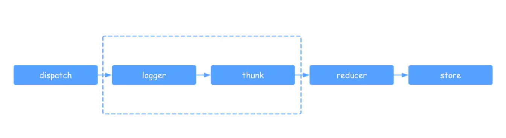

## 一、Redux做了什么

其实我们只是想找个地方存放一些共享数据，所有文件都可以获取到，也都可以进行修改。

### 1. 那放在一个全局变量里面行不行？
```javascript
const state = {    
  count: 0
}
```
行，但是有两个问题：

1. 容易误操作：比如有人一个不小心把store赋值了{}，清空了store，或者误修改了其他组件的数据，那显然不太安全，出错了也很难排查，因此我们需要有条件地操作store，防止使用者直接修改store的数据

2. 可读性很差: JS是一门极其依赖语义化的语言，试想如果在代码中不经注释直接修改了公用的state，以后其他人维护代码得多懵逼，为了搞清楚修改state的含义还得根据上下文推断，所以我们最好是给每个操作起个名字。

### 2. getter 和 setter

根据我们上面的分析，我们希望公共状态既能够被全局访问到，又是私有的不能被直接修改，思考一下，闭包是不是就就正好符合这两条要求，因此我们会把公共状态设计成`闭包`

现在要写这样一个函数，其满足：

- 存放一个数据对象
- 外界能访问到这个数据
- 外界也能修改这个数据
- 当数据有变化的时候，通知订阅者


```javascript
function createStore(reducer, initialState) {
  let currentState = initialState; // 1. 公共状态    
  let listener = () => {};

  function getState() { // 2. getter
    return currentState;
  }
  function dispatch(action) { // 3. setter
    currentState = reducer(currentState, action); // 更新数据
    listener(); // 执行订阅函数
    return action;
  }
  function subscribe(newListener) { // 4. 发布订阅    
    listener = newListener;
    // 取消订阅函数
    return function unsubscribe() {
      listener = () => {};
    };
  }
  return {
    getState,
    dispatch,
    subscribe
  };
}

const store = createStore(reducer);
store.getState(); // 获取数据
store.dispatch({type: 'ADD_TODO'}); // 更新数据
store.subscribe(() => {/* update UI */}); // 注册订阅函数
```

上面的 initialState 是为了获取初始state，除了把initialState通过传参传进来，还可以通过先进行一次初始化dispatch的方式

```javascript
export const createStore = (reducer) => {        
    let currentState = {}        
    function getState() { ... }        
    function dispatch() { ... }        
    function subscribe() { ... }    
    // 初始化store数据 
    // 这个dispatch的actionType可以随便填，只要不和已有的type重复，让reducer里的switch能走到default去初始化store就行了
    dispatch({ type: '@@REDUX_INIT' })
    return { ... }
}
```

更新数据执行的步骤：

- What：想干什么 --- dispatch(action)
- How：怎么干，干的结果 --- reducer(oldState, action) => newState
- Then?：重新执行订阅函数（比如重新渲染UI等）

这样就实现了一个store，提供一个数据存储中心，可以供外部访问、修改等，这就是Redux的主要思想。

所以，Redux和React没有什么本质关系，Redux可以结合其他库正常使用。只不过Redux这种数据管理方式，跟React的数据驱动视图理念很合拍，它俩结合在一起，开发非常便利。

### 3. 那么redux怎么和react关联起来呢？

我们可以在应用初始化的时候，创建一个`window.store = createStore(reducer)`或每个组件通过`import引入store`，然后在需要的地方通过`store.getState()`获取数据，通过`store.dispatch`更新数据，通过`store.subscribe`订阅数据变化然后进行setState...如果很多地方都这样做一遍，实在是不堪其重。

## 二、React-Redux 的实现

React恰好提供了一个钩子--Context（可以参考 [这里](/Redux/aboutRedux/#使用Context解决场景一) 回顾一下）,可以让每个子组件都能访问到store。

接下来，就是子组件把store中用到的数据取出来、修改、以及订阅更新UI等。每个子组件都需要这样做一遍，显然，肯定有更便利的方法：高阶组件。

通过高阶组件把`store.getState()、store.dispatch、store.subscribe`封装起来，子组件对store就无感知了，子组件正常使用props获取数据以及正常使用callback触发回调，相当于没有store存在一样。

react-redux提供`Provider`和`connect`两个API，Provider将store放进this.context里，省去了import这一步，connect将getState、dispatch合并进了this.props，并自动订阅更新，简化了另外三步，下面我们来看一下如何实现这两个API：

### 1. Provider实现

Provider是一个组件，接收store并放进全局的context对象

```javascript
class Provider extends React.Component {
  constructor(props, context) {    
    super(props, context)    
    this.store = props.store  
  }
  // 需要声明静态属性childContextTypes来指定context对象的属性,是context的固定写法  
  static childContextTypes = {
    store: ProtoTypes.object
  }
  // 实现getChildContext方法,返回context对象,也是固定写法  
  getChildContext() {    
    return { store: this.store }  
  }
  // 渲染被Provider包裹的组件  
  render() {    
    return this.props.children  
  }
}
```

完成Provider后，我们就能在组件中通过this.context.store这样的形式取到store，不需要再单独import store或把store放到全局变量里了。


### 2. connect实现

下面我们来思考一下如何实现connect，我们先回顾一下connect的使用方法：
```javascript
connect(mapStateToProps, mapDispatchToProps)(App)
```

我们已经知道，connect接收mapStateToProps、mapDispatchToProps两个方法，然后返回一个高阶函数，这个高阶函数接收一个组件，返回一个高阶组件（其实就是给传入的组件增加一些属性和功能）connect根据传入的map，将state和dispatch(action)挂载子组件的props上


下面是connect高阶组件的大致实现：

```javascript
function connect(mapStateToProps, mapDispatchToProps) {
  return function(WrappedComponent) {
    return class Connect extends React.Component {
      componentDidMount() {
        // 从context获取store并订阅更新 
        this.unsubscribe = this.context.store.subscribe(this.handleStoreChange.bind(this))
      }
      componentWillUnmount() {
        this.unsubscribe();
      }
      handleStoreChange() {
        // 触发更新          
        // 触发的方法有多种,这里为了简洁起见,直接forceUpdate强制更新,读者也可以通过setState来触发子组件更新
        this.forceUpdate()
      }
      render() {
        return (
          <WrappedComponent
            // 传入该组件的props,需要由connect这个高阶组件原样传回原组件 
            {...this.props}
            // 根据mapStateToProps把state挂到this.props上
            {...mapStateToProps(this.context.store.getState())}
            // 根据mapDispatchToProps把dispatch(action)挂到this.props上 
            {...mapDispatchToProps(this.context.store.dispatch)}
          />
        )
      }
    }
    //接收context的固定写法      
    Connect.contextTypes = {        
        store: PropTypes.object      
    }      
    return Connect
  }
}
```
其实connect完全可以把App跟着mapStateToProps一起传进去，看似没必要return一个函数再传入App，为什么react-redux要这样设计呢？

其实connect这种设计，是`装饰器模式`的实现，所谓装饰器模式，简单地说就是对类的一个包装，动态地拓展类的功能。connect以及React中的高阶组件（HoC）都是这一模式的实现。除此之外，也有更直接的原因：这种设计能够兼容ES7的装饰器(Decorator)，使得我们可以用@connect这样的方式来简化代码

### 3. combineReducers 实现


### 4. compose 实现


## 三、redux Middleware实现

所谓中间件，我们可以理解为拦截器，用于对某些过程进行拦截和处理，且中间件之间能够串联使用。在redux中，我们中间件拦截的是dispatch提交到reducer这个过程（位于 action 被发起之后，到达 reducer 之前的扩展点），从而增强dispatch的功能。



middleware 最优秀的特性就是可以被链式组合。你可以在一个项目中使用多个独立的第三方 middleware。
你所使用的任何 middleware 都可以以自己的方式解析你 dispatch 的任何内容，并继续传递 actions 给下一个 middleware。

但当 middleware 链中的最后一个 middleware 开始 dispatch action 时，这个 action 必须是一个普通对象。这是同步式的 Redux 数据流 开始的地方（注：这里应该是指，你可以使用任意多异步的 middleware 去做你想做的事情，但是需要使用普通对象作为最后一个被 dispatch 的 action ，来将处理流程带回同步方式）。

下面我们以一个记录日志的中间件为例，一步一步分析redux中间件的设计实现。

我们思考一下，如果我们想在每次dispatch之后，打印一下store的内容，我们会如何实现呢：

### 1. 在每次dispatch之后手动打印store的内容

```js
store.dispatch({ type: 'plus' })
console.log('next state', store.getState())
```

这是最直接的方法，虽然这样做达到了想要的效果，但是你并不想每次都这么干，我们至少要把这部分功能提取出来。

### 2. 封装公共 dispatchAction 方法

```js
function dispatchAndLog(store, action) {    
  store.dispatch(action)    
  console.log('next state', store.getState())
}
```

你可以选择到此为止，但是每次都要导入一个外部方法总归还是不太方便。

### 3. Monkeypatching Dispatch - 替换dispatch方法

> Monkeypatch是什么？
> 根据在网上的搜索，应该是python中常用的技巧 -- 猴子补丁，属性在运行时的动态替换
> 主要用处是：在运行时替换方法、属性等；在不修改第三方代码的情况下增加原来不支持的功能
> 猴子补丁的起源？
> 《松本行弘的程序世界》这本书里面专门有一章讲了猴子补丁的设计：所谓的猴子补丁的含义是指在动态语言中，不去改变源码而对功能进行追加和变更。猴子补丁的这个叫法起源于Zope框架，大家在修正Zope的Bug的时候经常在程序后面追加更新部分，这些被称作是“杂牌军补丁(guerilla patch)”，后来guerilla就渐渐的写成了gorllia(猩猩)，再后来就写了monkey(猴子)，所以猴子补丁的叫法是这么莫名其妙的得来的。

```js
let next = store.dispatch
store.dispatch = function dispatchAndLog(action) {  
  let result = next(action)  
  console.log('next state', store.getState())  
  return result
}
```

如果我们直接把dispatch给替换，这样每次使用的时候不就不需要再从外部引用一次了吗？
对于单纯打印日志来说，这样就足够了。
但是如果我们还有一个监控dispatch错误的需求呢？
我们当然可以在打印日志的代码后面加上捕获错误的代码，但随着功能模块的增多，代码量会迅速膨胀，以后这个中间件就没法维护了，我们希望不同的功能是独立的可拔插的模块。

### 4. 模块化

```js
function patchStoreToAddLogging (store) {
  let next = store.dispatch
  store.dispatch = (action) => {
    let result = next(action)  
    console.log('next state', store.getState())
    return result
  } 
}

function patchStoreToAddCrashReporting (store) {
  let next = store.dispatch
  store.dispatch = (action) => {
    try {            
      return next(action)        
    } catch (err) {            
      console.error('捕获一个异常!', err)            
      throw err        
    }
  } 
}
```

我们把不同功能的模块拆分成不同的方法，通过在方法内获取上一个中间件包装过的store.dispatch实现链式调用。然后我们就能通过调用这些中间件方法，分别使用、组合这些中间件。

```js
patchStoreToAddLogging(store)
patchStoreToAddCrashReporting(store)
```

到这里我们基本实现了可组合、拔插的中间件，但我们仍然可以把代码再写好看一点。
我们注意到，我们当前写的中间件方法都是先获取dispatch，然后在方法内替换dispatch，这部分重复代码我们可以再稍微简化一下：
我们不在方法内替换dispatch，而是返回一个新的dispatch，然后让循环来进行每一步的替换。

### 5. applyMiddleware - 隐藏 Monkeypatching

```js
function logger (store) {
  let next = store.dispatch
  return (action) => {
    let result = next(action)  
    console.log('next state', store.getState())
    return result
  }
}
function applyMiddleware(store, middlewares) {
  // middlewares = [ ...middlewares ]  // 浅拷贝数组, 避免下面reserve()影响原数组  
  // middlewares.reverse()  // 由于循环替换dispatch时, 前面的中间件在最里层, 因此需要翻转数组才能保证中间件的调用顺序      
  middlewares.forEach(middleware => {
    store.dispatch = middleware(store)
  })
}
```
然后我们就能以这种形式增加中间件了：
```js
applyMiddleware(store, [logger, crashReporter])
```
尽管我们做了很多，实现方式依旧是 monkeypatching。
因为我们仅仅是将它隐藏在我们的框架内部，并没有改变这个事实。

### 6. 移除 Monkeypatching
