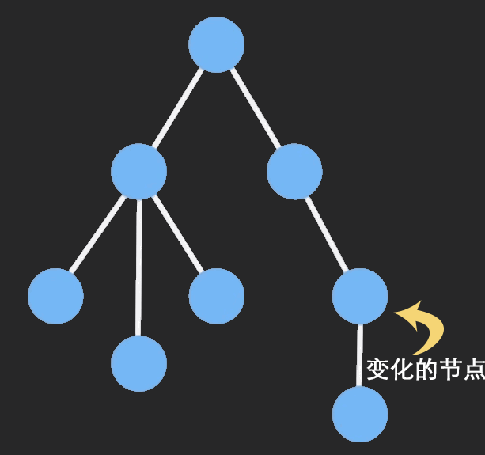

在谈及 Immutable 数据之前，我们先来聊聊 React 组件是怎么渲染更新的。

## React 组件的更新方式

### state的直接改变

React 组件的更新是由状组件态改变引起，这里的状态一般指组件内的 state 对象，当某个组件的 state 发生改变时，组件在更新的时候将会经历如下过程：

- shouldComponentUpdate
- componentWillUpdate
- render()
- componentDidUpdate

state 的更新一般是通过在组件内部执行 this.setState 操作, 但是 setState 是一个异步操作，它只是执行将要修改的状态放在一个执行队列中，React 会出于性能考虑，把多个 setState 的操作合并成一次进行执行。

### props 的改变

除了 state 会导致组件更新外，外部传进来的 props 也会使组件更新，但是这种是当子组件直接使用父组件的 props 来渲染, 例如：

```js
render(){
	return <span>{this.props.text}</span>
}
```
当 props 更新时，子组件将会渲染更新，其运行顺序如下：

- componentWillReceiveProps (nextProps)
- static getDerivedStateFromProps()
- shouldComponentUpdate
- componentWillUpdate
- render
- getSnapshotBeforeUpdate()
- componentDidUpdate

### state 的间接改变

还有一种就是将 props 转换成 state 来渲染组件的，这时候如果 props 更新了，要使组件重新渲染，就需要在 componentWillReceiveProps 生命周期中将最新的 props 赋值给 state

## React 的组件更新过程

当某个 React 组件发生更新时（state 或者 props 发生改变），React 将会根据新的状态构建一棵新的 Virtual DOM 树，然后使用 diff 算法将这个 Virtual DOM 和 之前的 Virtual DOM 进行对比，如果不同则重新渲染。React 会在渲染之前会先调用 shouldComponentUpdate 这个函数是否需要重新渲染，React 中 shouldComponentUpdate 函数的默认返回值是 true，所以组件中的任何一个位置发生改变了，组件中其他不变的部分也会重新渲染。

### PureComponent 的浅比较

基于上面提到的性能问题，所以 React 又推出了 PureComponent，通过
```js
shouldUpdate =
  !shallowEqual(prevProps, nextProps) ||
  !shallowEqual(inst.state, nextState)
```
判断组件是否应该更新

利用上述两种方法虽然可以避免没有改变的元素发生不必要的重新渲染，但是下面的这些场景还是会带来一些问题：

### 场景1

如果state如下，直接修改了data.list[0].name = 'ccc'，本期望在改变之后组件可以重新渲染，但实际上并不会渲染

```js
const data = {
  list: [{
    name: 'aaa',
    sex: 'man'
  },{
    name: 'bbb',
    sex: 'woman'
  }],
  status: true,
}
```

### 场景2

如果state如下，数据异常丰富，需要修改深层级的某一个值时
如果用`Object.assign`写法过于复杂，且深层还是浅拷贝；如果用`深拷贝`浪费内存，且深拷贝复杂引用类型时需要深度遍历，这样的做法在React这样频繁更新数据的场景，性能不佳

```js
const data = {
  a: {
    a: {a: 1,b: {a:3, b:5, c: {a: {a: {b: 0}}}},
    b: {a: 2,b: {a:3, b:5, c: {a: {a: {b: 0}}}}}
  }
}
```

## immutable 登场

### immutable 是什么



> 相对于muttable，Immutable就是在创建变量，赋值后便不可更改，若对其有任何变更，就会传回一个新值

### immutable 和 mutable对比

```js
state = {
  count1: {
    a: 1,
  }
  count2: fromJS({
    a: 1,
  }),
};
handleClick = () => { 
  this.state.count1.a = 9
  console.log(this.state.count1.a) // 是9

  this.state.count2.set('a', 9)
  console.log(this.state.count2.getIn('a')) // 还是1，因为上边set更改之后返回了一个新的数据
```

```js
state = {
  count1: {
    a: 1,
  }
  count2: fromJS({
    a: 1,
  }),
};
handleClick = () => { 
  this.state.count1.a = 9
  console.log(this.state.count1.a) // 是9

  const count2 = this.state.count2.set('a', 9)
  this.state.count2 = count // 手动赋值
  console.log(this.state.count2.getIn('a')) // 是9，注意 仍不会触发render
```

### immutable 原理


