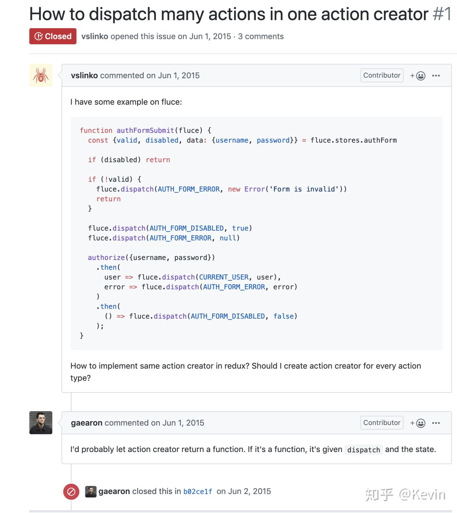
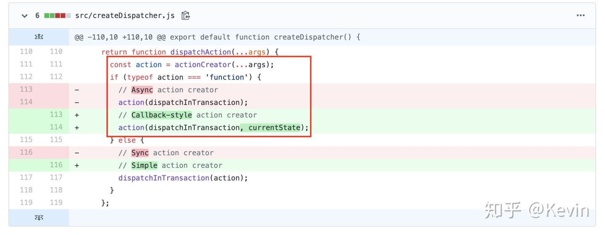

## Redux Thunk - 用最简单的方式搭建异步 action 构造器

之前我们的action创建函数返回的都是一个对象，使用 Redux Thunk 中间件后，action 创建函数除了返回 action 对象外还可以返回函数。这时，这个 action 创建函数就成为了 thunk。
当 action 创建函数返回函数时，这个函数会被 Redux Thunk middleware 执行。
这个函数并不需要保持纯净；它还可以带有副作用，包括执行异步 API 请求。这个函数还可以 dispatch action，就像 dispatch 前面定义的同步 action 一样。

### 用thunk改写同步action

```js
// 新增 thunk action
// 调用方式和普通action一样 store.dispatch(fetchPosts('reactjs'))
export function fetchPost(subreddit) {
  // 这里把 dispatch 方法通过参数的形式传给函数，
  // 以此来让它自己也能 dispatch action。
  return function (dispatch, getState) {
    dispatch(requestPosts(subreddit))

    // thunk middleware 调用的函数可以有返回值，
    // 它会被当作 dispatch 方法的返回值传递。
    // 比如下面返回一个Promise，可以让 store.dispatch(fetchPosts('reactjs')).then(...)

    return fetch(`http://www.subreddit.com/r/${subreddit}.json`)
      .then(res => {
        dispatch(receivePosts(subreddit, res))
      })
  }
}
```

### thunk起源

关于redux-thunk的起源可以看一下 Redux 001 号的 issue: How to dispatch many actions in one action creator[1]



大概意思就是问如何一次性发起多个 action，然后作者回答我可以让 actionCreator 返回一个函数。然后相关的 PR 如下： fix issue 001[2]



那个时候redux-thunk还没有独立，而是写在redux的 action 分发函数中的一个代码分支而已。和现在的redux-thunk逻辑一样，它会判断如果传入的 action 是一个function，就调用这个函数。现在将redux-thunk独立出去，用 middleware 的方式实现，会让 redux 的实现更加统一。


### thunk源码

由于redux-thunk的代码量非常少，我们直接把它的代码贴上来看一下。这里我们看的是v2.3.0的代码：

```js
function createThunkMiddleware(extraArgument) {
  return ({ dispatch, getState }) => next => action => {
    if (typeof action === 'function') {
      return action(dispatch, getState, extraArgument);
    }

    return next(action);
  };
}

const thunk = createThunkMiddleware();
thunk.withExtraArgument = createThunkMiddleware;

export default thunk;
```

它的核心代码其实只有两行，就是判断每个经过它的action：如果是function类型，就调用这个function（并传入 dispatch 和 getState 及 extraArgument 为参数），而不是任由让它到达 reducer，因为 reducer 是个纯函数，Redux 规定到达 reducer 的 action 必须是一个 plain object 类型。


