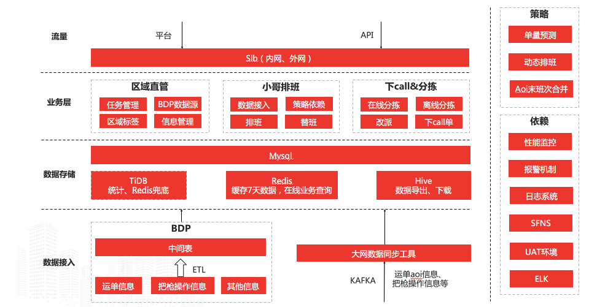
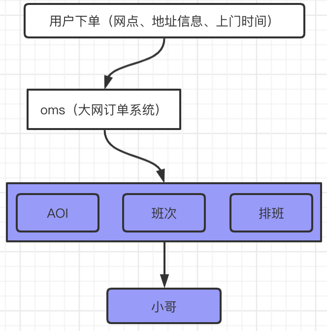

## sds系统介绍
sds，又名智域，是物流平台中心研发的一款O线业务；旨在打造顺丰末端收派平台，将全网30万顺丰小哥集中管理，管理维度包含地理和行政两大类，以AOI、AOI区域、网点将顺丰小哥进行划分管理；

上图是系统架构图，从业务层也能看出，主要包含三大块内容，小哥排班、区域直管、对外API（下call、分拣等）；
小哥排班：顾名思义就是对顺丰小哥的收件、派件任务进行排班；
区域直管：是指对一线（顺丰小哥）、二线（网管等）工作人员工作内容的考察和监督；
下面我们重点介绍对外API；

## 对外api
主要包括两大块， 下call、分拣，下call是针对收件，指用户在顺丰客户端寄快递后系统分配小哥的过程；分拣是针对派件，指顺丰快件分给哪位小哥派送的过程；这里以下call为例，给出整体的系统调用过程；因为小哥的收派件信息都在sds维护，所以用户下订单选择小哥肯定是由sds提供，分拣也是同样；下图是以下call为例，具体展示了下call的流程图，用户下call后，会带着地址、时间等信息，会通过大网订单系统OMS，由OMS对SDS完成下call操作，具体包含AOI解析、班次解析，通过排班，找到对应小哥；

## 遇到的问题和解决方案
稳定性要求高，前期架构不能满足业务增长需求
由于下call、分拣是顺丰核心业务，直接影响顺丰收入和对外品牌形象，所以对稳定性要求极高；SDS前期是试点业务，开通网点不多，流量不大，所以系统架构相对简单，存储也大胆启动了业界新型分布式存储系统TIDB，整体没有出现大的系统瓶颈；但是随着开通网点不多增多，下call、分拣的流量成指数级增长，对原有系统架构带来挑战；

### 1 存储瓶颈
问题：首先就是存储，由于sds前期大胆采用新型分布式存储系统tidb，在存储量级不大，并发请求不高的情况下，也相安无事；随着存储量级逐渐增大，顺丰全网每天的单量有2500万左右，tidb存储达到几十亿量级，甚至有些运单表已经达到上百亿，同时我们缺乏对tidb成熟的运维经验；这时下call请求对tidb的增删改查就出现了瓶颈，主要表现为慢查询、更新失败等；
方案：所以我们下定决心在存储上去tidb，对外api核心接口不再依赖tidb；我们发现下call、分拣在业务上具有实时性，比如当天的分拣肯定是查询的当天的运单数据，所以很容易想到就是做冷热分离，我们把热点数据按照天级别存储，在存储量级上能极大缩小存储范围；我们具体采用的是用redis存储当天的运单数据，合理设置失效时间，防止缓存穿透；redis在抗并发能力上表现优秀，专门部署了一个集群，和其他业务隔离，避免互相影响；同时 tidb保持异步双写，也作为redis的数据降级使用，这样tidb只是作为一个整体的快照存储，用于一些离线的查询需求；

### 2 瞬时流量较高，高并发
问题：由于顺丰的快件分拣操作主要集中在早上7-9点，所以存在明显的流量高峰；同时顺丰有大量的预约单，OMS给SDS下单会把同一时刻的预约单在整点下达给SDS； 综合以上瞬时API流量能达到6000qps；
方案：为了应对瞬时流量，我们对OMS提出了打散流量的要求，OMS在一定程度上打散了流量，但是受限于顺丰的业务特定，并不能在根本上解决问题；所以我们对整个系统做了压测，针对压测结论有针对性进行扩容；同时对压测做了例行规范，比如每当有城市开通流量，或者可遇见的活动，比如6.18大促、双11等； 预知流量瓶颈，从而对症下药；高并发下，API流量只保留了查询需要，对插入、更新操作统一做了异步处理，利用消息队列对插入、更新流量做了限制； 一方面是为了减少对外API的耗时，另一方面是为了减少对mysql等主库的压力，从而造成雪崩效应；最后就是服务隔离，对外API的服务在部署上和其他业务隔离，避免互相影响，最大可能的保证服务可用性；

### 3 数据依赖多源性，高可用、数据一致性
问题：对外API依赖的基础数据都来自于大网不同的业务系统，比如AOI信息、小哥信息、班次信息都来自于不同的业务方；所以这些业务系统的稳定性，以及我们同步基础数据的稳定性就成了非常重要的因素；
方案：为了保证基础数据的高可用，首先就是提前获取基础数据，顺丰会提前安排这些基础数据，所以要求我们最短也要前一天拿到，保证数据不遗漏；其次我们完善了监控，第一时间知晓基础数据缺失问题；最后在基础数据的正确性上，我们也做了很多探索性的尝试，比如前后数据对比、分析等，也有效的保证了基础数据的正确性；
为了保证基础数据的一致性，我们双管齐下，一个是全量同步，对方会把数据统一放在bdp上，我们从bdp上全量同步；另外一个就是增量同步，从大网kafka上增量同步基础数据； 双效保证数据一致性；

### 4 调用方信息缺失，业务降级
问题：前面提到基础运单数据的降级，同时下call、分拣等也存在一定的核心数据缺失，比如单元区域数据缺失，会造成对应aoi无法获取；还有就是sds排班数据问题，比如某个AOI没有排班，很可能会没有小哥返回；造成下call、分拣等请求无效；
方案：这时候就要求我们在业务上进行降级；保证下call、分拣等请求的有效返回；比如请求中AOI缺失，我们会根据单元区域或者地址信息去GIS重新获取aoi； 比如排班出现问题，我们会去AOI配置中去获取对应的小哥；

## 效果
从前期两次事故后，我们基本没有再出过有影响的事故；

## 未来todo
前面讲过应对高并发请求，我们对服务做了隔离，但是不存粹；将来会把对外API进行服务拆分，尝试微服务化，完成彻底的服务单元化；
保证容灾，我们会做异地多活，这样也能避免将最小的故障概率；
