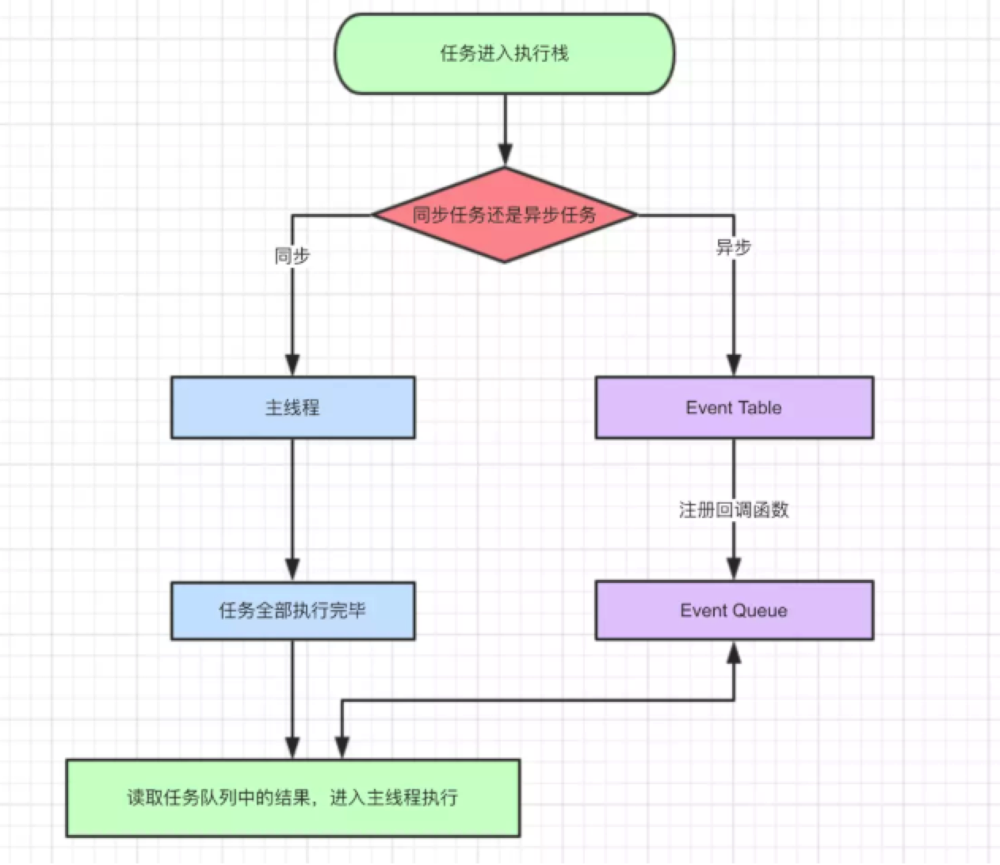

> javascript是一门单线程语言
> Event Loop是javascript的执行机制

观察下面代码的执行顺序
```
    console.log(1)
    
    setTimeout(function(){
        console.log(2)
    }，0)

    console.log(3)
```
    
运行结果是: 1 3 2

也就是说，setTimeout里的函数并没有立即执行，而是延迟了一段时间，满足一定条件后，才去执行的，这类代码，我们叫异步代码。
所以，这里我们首先知道了JS里的一种分类方式，就是将任务分为: 同步任务和异步任务



导图要表达的内容用文字来表述的话：

同步和异步任务分别进入不同的执行"场所"，同步的进入主线程，异步的进入Event Table并注册函数。
当指定的事情完成时，Event Table会将这个函数移入Event Queue。
主线程内的任务执行完毕为空，会去Event Queue读取对应的函数，进入主线程执行。
上述过程会不断重复，也就是常说的Event Loop(事件循环)。

我们不禁要问了，那怎么知道主线程执行栈为空啊？js引擎存在monitoring process进程，会持续不断的检查主线程执行栈是否为空，一旦为空，就会去Event Queue那里检查是否有等待被调用的函数。

我们猜测JS的执行机制是

* 首先判断JS是同步还是异步，同步就进入主线程，异步就进入event table
* 异步任务在event table中注册函数，当满足触发条件后，被推入event queue
* 同步任务进入主线程后一直执行，直到主线程空闲时，才会去event 

queue中查看是否有可执行的异步任务，如果有就推入主线程中。以上三步循环执行，这就是event loop。

但是再看下面这段代码

```
 setTimeout(function(){
     console.log('定时器开始啦')
 });
 
 new Promise(function(resolve){
     console.log('马上执行for循环啦');
     for(var i = 0; i < 10000; i++){
         i == 99 && resolve();
     }
 }).then(function(){
     console.log('执行then函数啦')
 });
 
 console.log('代码执行结束');
```
 
尝试按照上文猜测的JS执行机制去分析，结果应该是 【马上执行for循环啦 --- 代码执行结束 --- 定时器开始啦 --- 执行then函数啦

亲自执行后，结果却是【马上执行for循环啦 --- 代码执行结束 --- 执行then函数啦 --- 定时器开始啦】

## 宏任务和微任务

除了广义的同步任务和异步任务，我们对任务有更精细的定义：

* macro-task(宏任务)：包括整体代码script，setTimeout，setInterval
* micro-task(微任务)：Promise，process.nextTick

不同类型的任务会进入对应的Event Queue，比如setTimeout和setInterval会进入相同的Event Queue。
process.nextTick(callback)类似node.js版的"setTimeout"

事件循环的顺序，决定js代码的执行顺序。进入整体代码(宏任务)后，开始第一次循环。接着执行所有的微任务。然后再次从宏任务开始，找到其中一个任务队列执行完毕，再执行所有的微任务。


## setTimeout的意思

这段setTimeout代码什么意思? 我们一般说: 3秒后，会执行setTimeout里的那个函数
```
 setTimeout(function(){
    console.log('执行了')
 }，3000)    
```
但是这种说并不严谨，准确的解释是: 3秒后，setTimeout里的函数被会推入event queue，而event queue(事件队列)里的任务，只有在主线程空闲时才会执行。
所以只有满足 (1)3秒后 (2)主线程空闲，同时满足时，才会3秒后执行该函数
如果主线程执行内容很多，执行时间超过3秒，比如执行了10秒，那么这个函数只能10秒后执行了

## 写在最后

### js的异步

我们从最开头就说javascript是一门单线程语言，不管是什么新框架新语法糖实现的所谓异步，其实都是用同步的方法去模拟的，牢牢把握住单线程这点非常重要。

### 事件循环Event Loop

事件循环是js实现异步的一种方法，也是js的执行机制。

### javascript的执行和运行

执行和运行有很大的区别，javascript在不同的环境下，比如node，浏览器，Ringo等等，执行方式是不同的。而运行大多指javascript解析引擎，是统一的。

### setImmediate

微任务和宏任务还有很多种类，比如setImmediate等等，执行都是有共同点的，有兴趣的同学可以自行了解。

### 最后的最后
javascript是一门单线程语言
Event Loop是javascript的执行机制

## 练习题

**练习1**

```
console.log('======== main task start ========'); // 1
new Promise(resolve => {
    console.log('create micro task 1'); // 2
    resolve();
}).then(() => {
    console.log('micro task 1 callback'); // 微1.1 6
    setTimeout(() => {
        console.log('macro task 3 callback'); // 宏2 12
    }, 0);
})

console.log('create macro task 2'); // 3
setTimeout(() => { // 宏1
    console.log('macro task 2 callback'); // 8
    new Promise(resolve => {
        console.log('create micro task 3'); // 9
        resolve();
    }).then(() => {
        console.log('micro task 3 callback'); // 微1.3 11
    })
    console.log('create macro task 4'); // 10
    setTimeout(() => {
      console.log('macro task 4 callback'); // 宏3 13
    }, 0);
}, 0);

new Promise(resolve => {
  console.log('create micro task 2'); // 4
  resolve();
}).then(() => {
  console.log('micro task 2 callback'); // 微1.2 7
})

console.log('======== main task end ========'); // 5
```

**练习2**

```
async function async1() {
    console.log('async1 start') // 2
    await async2()
    console.log('async1 async2') // 微1.1 6
    await async3()
    console.log('async1 async3') // 微1.3 9
    const a = await async4()
    console.log(a)
}

async function async2() {
    console.log('async2') // 3 
}
async function async3() {
    console.log('async3') // 7 
}
async function async4() {
    console.log('async4') // 10 
    return new Promise(resolve => {
        setTimeout(() => resolve('async4 setTimeout'), 0) // 12 
    })
}

console.log('script start') // 1 

setTimeout(function() { // 宏1
    console.log('setTimeout') // 11
}, 0)

async1()

new Promise(function(resolve) {
    console.log('promise1') // 4 
    resolve()
}).then(function() {
    console.log('promise2') // 微1.2 8 
})

console.log('script end') // 5
```

**练习3**

```
console.log('1'); // 1

setTimeout(function() { // 宏1
    console.log('2'); // 5 
    process.nextTick(function() { // 微2.1
        console.log('3'); // 9 
    })
    new Promise(function(resolve) {
        console.log('4'); // 6 
        resolve();
    }).then(function() {
        console.log('5') //微2.2 10
    })
})
process.nextTick(function() { // 微1.1 3
    console.log('6');
})
new Promise(function(resolve) {
    console.log('7'); // 2
    resolve();
}).then(function() {
    console.log('8') // 微1.2 4
})

setTimeout(function() { // 宏2
    console.log('9'); // 7
    process.nextTick(function() { // 微2.3
        console.log('10');  // 11
    })
    new Promise(function(resolve) {
        console.log('11'); // 8
        resolve();
    }).then(function() {
        console.log('12') // 微2.4 12
    })
})
```

**练习4**

```
async function async1() {
    console.log( 'async1 start' )
    await async2()
    console.log( 'async1 end' )
}
async function async2() {
    console.log( 'async2' )
}
console.log( 'script start' )
setTimeout( function () {
    console.log( 'setTimeout' )
}, 0 )
async1();
new Promise( function ( resolve ) {
    console.log( 'promise1' )
    resolve();
} ).then( function () {
    console.log( 'promise2' )
} )
console.log( 'script end' )
```

**答案**

练习1: 
======== main task start ========
create micro task 1
create macro task 2
create micro task 2
======== main task end ========
micro task 1 callback
micro task 2 callback
macro task 2 callback
create micro task 3
create macro task 4
macro task 3 callback
micro task 3 callback
macro task 4 callback


练习2:
script start
async1 start
async2
promise1
script end
async1 async2
async3
promise2
async1 async3
async4
setTimeout
async4 setTimeout

练习3：
1
7
6
8
2
4
9
11
3
10
5
12

练习4:
script start
async1 start
async2
promise1
script end
async1 end
promise2
setTimeout