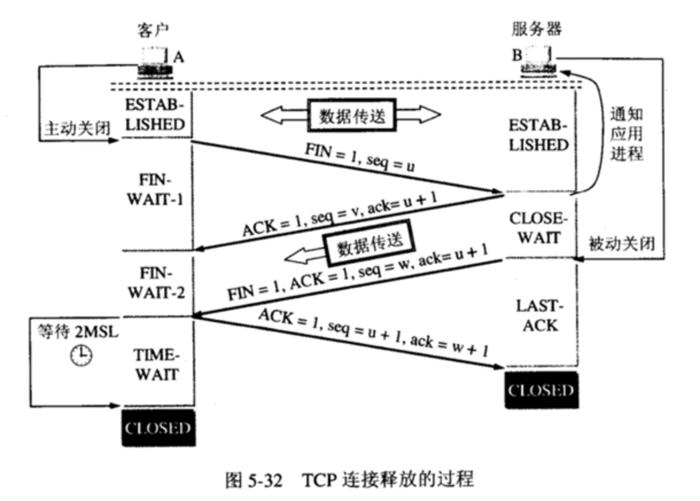

### 服务器返回 HTTP 响应报文

### 关闭 TCP 连接（四次挥手）

#### 通俗理解：

客户端：“你好，我这边没有数据要传了，我要关闭咯。”  
服务端：“收到～我看一下我这边有没数据要传的。”

服务端传输剩余数据

服务端：“我这边也没有数据要传啦，我们可以关闭连接咯～”  
客户端：”ojbk～“

#### 过程：

**第一次挥手**：Client端发起中断连接请求，也就是先向其 TCP 发出连接释放报文段（FIN = 1，序号 seq = u），并停止再发送数据，主动关闭 TCP 连接，进入 FIN-WAIT-1（终止等待1）状态，等待 Server 的确认。

**第二次挥手**：Server端接到连接释放报文段，意思是说"我Client端没有数据要发给你了"，但是如果服务器还有数据没有发送完成，则不必急着关闭Socket，可以继续发送数据。所以服务器先发送确认报文段（ACK = 1，确认号 ack = u + 1，序号 seq = v），"告诉Client端，你的请求我收到了，但是我还没准备好，请继续你等我的消息"。

这个时候Server 进入 CLOSE-WAIT（关闭等待）状态，Client端进入FIN-WAIT-2状态，继续等待Server端的FIN报文。此时的 TCP 处于半关闭状态，Client 到 Server 的连接释放。

**第三次挥手**：当Server端确定数据已发送完成，则向Client端发送FIN报文-连接释放报文段（FIN = 1，ACK = 1，序号 seq = w，确认号 ack = u + 1），”告诉Client端，好了，我这边数据发完了，准备好关闭连接了"，Server 进入 LAST-ACK（最后确认）状态，等待 Client 的确认。

**第四次挥手**：Client端收到连接释放报文段后，"就知道可以关闭连接了，但是他还是不相信网络，怕Server端不知道要关闭，所以发送确认报文段（ACK = 1，seq = u + 1，ack = w + 1）后进入TIME\_WAIT状态，如果Server端没有收到ACK则可以重传。“，Server端收到ACK后，"就知道可以断开连接了"。Client端等待了2MSL后依然没有收到回复，则证明Server端已正常关闭，那好，我Client端也可以关闭连接了，Client 才进入 CLOSED 状态。Ok，TCP连接就这样关闭了！

**问：为什么客户端在TIME-WAIT状态必须等待2MSL的时间？**

MSL为最长报文段寿命Maximum Segment Lifetime，MSL=2

两个理由：1）保证A发送的最后一个ACK报文段能够到达B。2）防止“已失效的连接请求报文段”出现在本连接中。

* 1）这个ACK报文段有可能丢失，使得处于LAST-ACK状态的B收不到对已发送的FIN+ACK报文段的确认，B超时重传FIN+ACK报文段，而A能在2MSL时间内收到这个重传的FIN+ACK报文段，接着A重传一次确认，重新启动2MSL计时器，最后A和B都进入到CLOSED状态，若A在TIME-WAIT状态不等待一段时间，而是发送完ACK报文段后立即释放连接，则无法收到B重传的FIN+ACK报文段，所以不会再发送一次确认报文段，则B无法正常进入到CLOSED状态。
* 2）A在发送完最后一个ACK报文段后，再经过2MSL，就可以使本连接持续的时间内所产生的所有报文段都从网络中消失，使下一个新的连接中不会出现这种旧的连接请求报文段。

