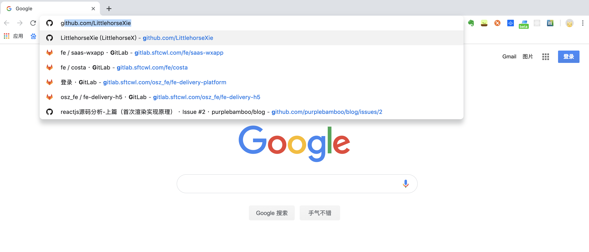
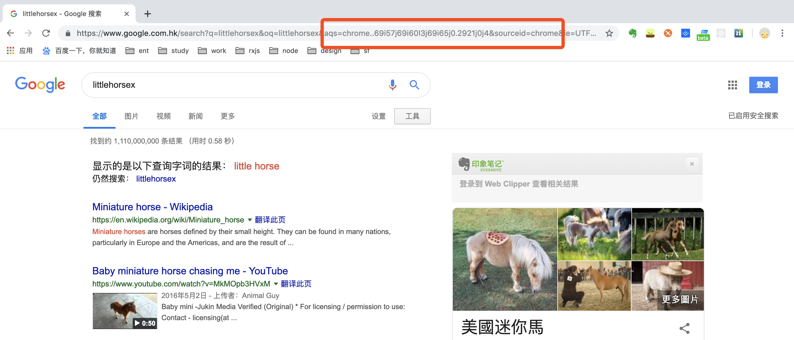
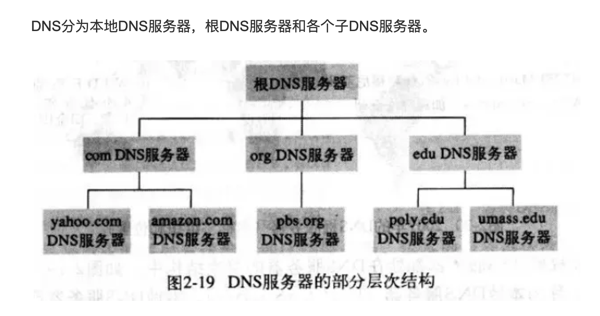
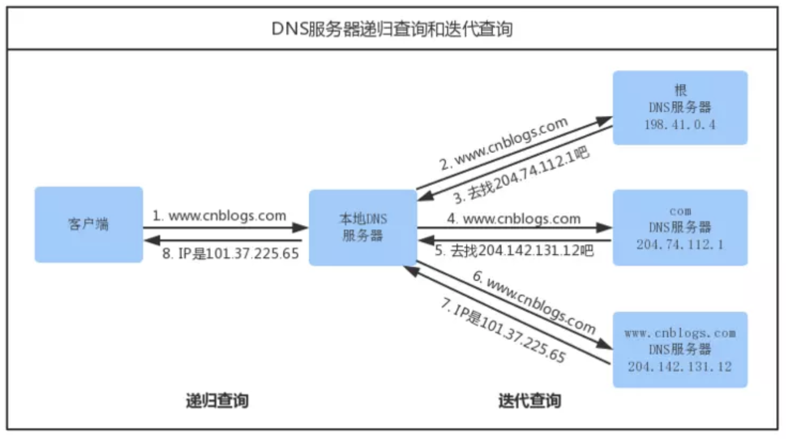

### 按下"g"键

当你按下“g”键，浏览器接收到这个消息之后，会触发自动完成机制。浏览器根据自己的算法，以及你是否处于隐私浏览模式，会在浏览器的地址框下方给出输入建议。大部分算法会优先考虑根据你的搜索历史和书签等内容给出建议。你打算输入 "google.com"，因此给出的建议并不匹配。但是输入过程中仍然有大量的代码在后台运行，你的每一次按键都会使得给出的建议更加准确。甚至有可能在你输入之前，浏览器就将 "google.com" 建议给你。

### 回车键按下

为了从零开始，我们选择键盘上的回车键被按到最低处作为起点。在这个时刻，一个专用于回车键的电流回路被直接地或者通过电容器间接地闭合了，使得少量的电流进入了键盘的逻辑电路系统。这个系统会扫描每个键的状态，对于按键开关的电位弹跳变化进行噪音消除\(debounce\)，并将其转化为键盘码值。在这里，回车的码值是13。键盘控制器在得到码值之后，将其编码，用于之后的传输。

### 解析URL

浏览器通过 URL 能够知道下面的信息：

* Protocol "http"
  使用HTTP协议

* Resource "/"
  请求的资源是主页\(index\)


### 输入的是 URL 还是搜索的关键字？

当协议或主机名不合法时，浏览器会将地址栏中输入的文字传给默认的搜索引擎。大部分情况下，在把文字传递给搜索引擎的时候，URL会带有特定的一串字符，用来告诉搜索引擎这次搜索来自这个特定浏览器。

### 转换非 ASCII 的 Unicode 字符

### DNS 域名解析

DNS（Domain Name System）是 域名系统 的英文缩写，提供的服务是用于将主机名和域名转换为 IP 地址的工作：将用户容易识别的字符串地址转换成电脑识别的ip地址。

1. 浏览器检查域名是否在自身缓存当中。如果缓存中有，则直接返回ip地址。如果缓存中没有，就去调用 gethostbyname 库函数（操作系统不同函数也不同）进行查询。gethostbyname 函数在试图进行DNS解析之前首先检查域名是否在本地 Hosts 里。
2. 如果 gethostbyname 没有这个域名的缓存记录，也没有在 hosts 里找到，或者已经过期，它将会向 DNS 服务器发送一条 DNS 查询请求。
3. 先查询本地 DNS 服务器，让它解析这个域名，如果解析不了，则向根域名服务器请求解析。
4. 根服务器给本地域名服务器返回一个主域名服务器。
5. 本地域名服务器向主域名服务器发起解析请求。
6. 主域名服务器接收到解析请求后，查找并返回域名对应的域名服务器的地址。
7. 域名服务器会查询存储的域名和 IP 的映射关系表，返回目标 IP 记录以及一个 TTL（Time To Live）值。
8. 本地域名服务器接收到 IP 和 TTL 值，进行缓存，缓存的时间由 TTL 值控制。
9. 将解析的结果返回给用户，用户根据 TTL 值缓存在本地系统缓存中，域名解析过程结束。

获取到了服务器的ip，接下来，浏览器和服务器就能进行交流了。

另：IP地址和MAC地址（物理地址）的之间的转化则需要依靠两个重要的协议ARP（地址解析协议），RARP（逆地址解析协议）。IP地址通过ARP转化成物理地址，物理地址可以通过RARP转化成相应的IP地址。

