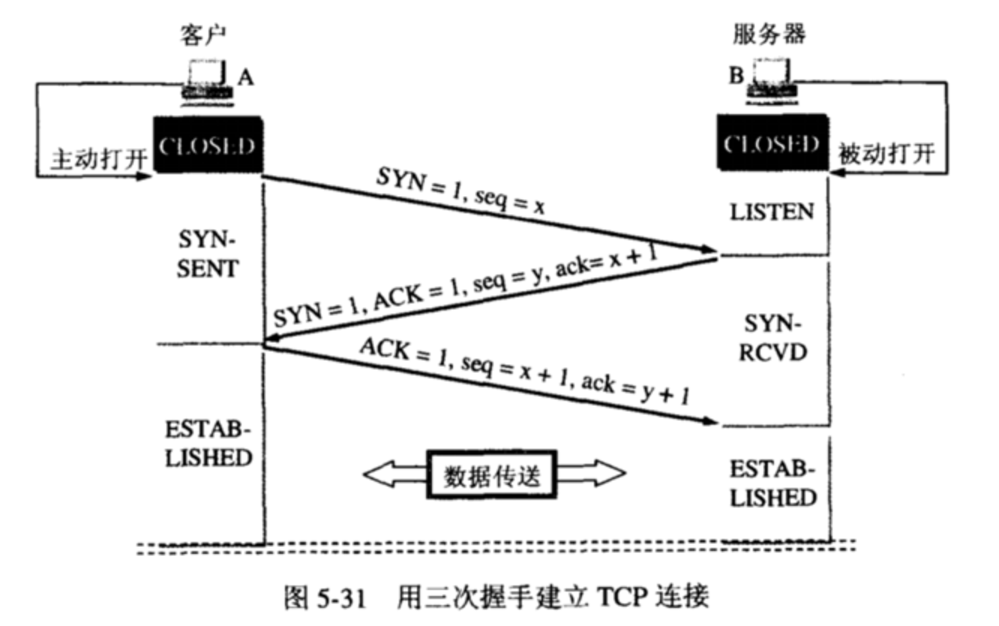

知道了服务器的ip地址之后，就开始与服务器建立连接了

### 建立 TCP 连接（三次握手）

TCP（Transmission Control Protocol 传输控制协议）是一种面向连接的、可靠的、基于字节流的传输层通信协议。 

简单来说，它的作用就是将数据流从一台主机可靠地传输到另一台主机。

#### 通俗理解：

客户端：你好在吗？我要发送/请求东西 

服务端：我在，你发吧 

客户端：好的

#### 过程：

**第一次握手**：两端都处于 CLOSED 关闭状态，Client 将标志位 SYN 置为 1，随机产生一个值 seq = x，并将该数据包发送给 Server，Client 进入 SYN-SENT 状态，等待 Server 确认。

**第二次握手**：Server 收到数据包后由标志位 SYN = 1 得知 Client 请求建立连接，Server 将标志位 SYN 和 ACK 都置为 1，ack = x + 1，随机产生一个值 seq = y，并将该数据包发送给Client以确认连接请求，Server 进入 SYN-RCVD 状态，此时操作系统为该 TCP 连接分配 TCP 缓存和变量（为这次连接分配资源）。

**第三次握手**：Client 收到确认后，检查 seq 是否为 x + 1，ACK 是否为 1，如果正确则将标志位 ACK 置为 1，ack = y + 1，并且此时操作系统为该 TCP 连接分配 TCP 缓存和变量，并将该数据包发送给 Server，Server 检查 ack 是否为 y + 1，ACK 是否为 1，如果正确则连接建立成功，Client 和 Server 进入 established 状态，完成三次握手，随后 Client 和 Server 就可以开始传输数据。

起初A和B都处于CLOSED状态——B创建TCB，处于LISTEN状态，等待A请求——A创建TCB，发送连接请求（SYN=1，seq=x），进入SYN-SENT状态——B收到连接请求，向A发送确认（SYN=ACK=1，确认号ack=x+1，初始序号seq=y），进入SYN-RCVD状态——A收到B的确认后，给B发出确认（ACK=1，ack=y+1，seq=x+1），A进入ESTABLISHED状态——B收到A的确认后，进入ESTABLISHED状态。

TCB传输控制块Transmission Control Block，存储每一个连接中的重要信息，如TCP连接表，到发送和接收缓存的指针，到重传队列的指针，当前的发送和接收序号。

**问：为什么A还要发送一次确认呢？可以二次握手吗？**

主要为了防止已失效的连接请求报文段突然又传送到了B，因而产生错误。

如A发出连接请求，但因连接请求报文丢失而未收到确认，于是A再重传一次连接请求。后来收到了确认，建立了连接。数据传输完毕后，就释放了连接，A共发出两个连接请求报文段，其中第一个丢失，第二个到达了B。但是第一个丢失的报文段只是在某些网络结点长时间滞留了，延误到连接释放以后的某个时间才到达B，此时B误认为A又发出一次新的连接请求，于是就向A发出确认报文段，同意建立连接，不采用三次握手，只要B发出确认，就建立新的连接了，此时A不理睬B的确认且不发送数据，则B一致等待A发送数据，浪费资源。

**问：Server端易受到SYN攻击？**

服务器端的资源分配是在二次握手时分配的，而客户端的资源是在完成三次握手时分配的，所以服务器容易受到SYN洪泛攻击，SYN攻击就是Client在短时间内伪造大量不存在的IP地址，并向Server不断地发送SYN包，Server则回复确认包，并等待Client确认，由于源地址不存在，因此Server需要不断重发直至超时，这些伪造的SYN包将长时间占用未连接队列，导致正常的SYN请求因为队列满而被丢弃，从而引起网络拥塞甚至系统瘫痪。

防范SYN攻击措施：降低主机的等待时间使主机尽快的释放半连接的占用，短时间受到某IP的重复SYN则丢弃后续请求。

### 浏览器发起 HTTP 请求报文

