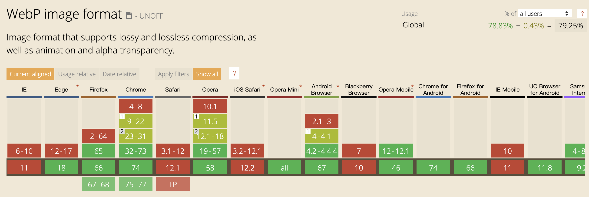

让图片加载这件事儿变得更美好


## 1 WebP

评价网站性能好坏的一个主要指标就是页面响应时间，也就是说用户打开完整页面的时间。基于JPEG还有PNG图片格式的网页，其图片资源加载往往都占据了页面耗时的主要部分，那么如何保证图片质量的前提下缩小图片体积，成为了一件有价值的事情。

而如今，对JPEG、PNG以及GIF这些格式的图片已经没有太大的优化空间。但是，Google推出的WebP图片格式给图片优化提供了另一种可能。

WebP是一种支持有损压缩和无损压缩的图片文件格式。可能是性价比最高的一种优化方式了。

### 1.1 优势

> 科技博客 Gig‍‍‍aOM 曾报道：YouTube 的视频略缩图采用 WebP 格式后，网页加载速度提升了 10%；谷歌的 Chrome 网上应用商店采用 WebP 格式图片后，每天可以节省几 TB 的带宽，页面平均加载时间大约减少 1/3；Google+ 移动应用采用 WebP 图片格式后，每天节省了 50TB 数据存储空间。

同样的质量下，更小的体积，更快的加载速度。

### 1.2 示例

下面我们以一张图片为例，分别用不同质量进行压缩。


可以看出， WebP 图片体积更小。

下面我们再看下 [60张jpg和webp加载比较](http://labs.qiang.it/wen/webp/test.html) 。

可以看出初次加载时 WebP 速度明显提升，但如果我们再次刷新（在开启页面缓存的情况下），会发现 WebP  的加载时间反而更长，下一小节再做解释。

### 1.3 劣势

既然Webp图片能明显提升页面的加载速度，为什么还有很多浏览器仍然在使用jpg图片呢？

首先，我们看一下WebP的兼容性，来源：[Can I Use WebP](https://caniuse.com/#search=webp)



由上图可以看出，目前Chrome兼容性最好（毕竟是自家产品），Safari兼容最差。总体来说，WebP的兼容性不太乐观。

其次，根据Google的测试，目前WebP与JPG相比较，编码速度慢10倍，解码速度慢1.5倍（因此在有浏览器缓存的情况下 WebP 加载时间会更长）。（但是，WebP虽然会增加额外的解码时间，但由于减少了文件体积，缩短了加载的时间，总体上仍会加快页面的渲染速度。缩短的加载时间远远大于解码所需要的时间。）

### 1.4 兼容性处理

思路：如果浏览器支持 WebP，把图片的链接改成 WebP 格式的

下面是Google官方提供的检测代码 可以检测 浏览器对 webp lossy 有损 lossless无损 alpha透明 animation动图的支持：

```javascript
function check_webp_feature(feature, callback) {
    var kTestImages = {
        lossy: "UklGRiIAAABXRUJQVlA4IBYAAAAwAQCdASoBAAEADsD+JaQAA3AAAAAA",
        lossless: "UklGRhoAAABXRUJQVlA4TA0AAAAvAAAAEAcQERGIiP4HAA==",
        alpha: "UklGRkoAAABXRUJQVlA4WAoAAAAQAAAAAAAAAAAAQUxQSAwAAAARBxAR/Q9ERP8DAABWUDggGAAAABQBAJ0BKgEAAQAAAP4AAA3AAP7mtQAAAA==",
        animation: "UklGRlIAAABXRUJQVlA4WAoAAAASAAAAAAAAAAAAQU5JTQYAAAD/////AABBTk1GJgAAAAAAAAAAAAAAAAAAAGQAAABWUDhMDQAAAC8AAAAQBxAREYiI/gcA"
    };
    var img = new Image();
    img.onload = function () {
        var result = (img.width > 0) && (img.height > 0);
        callback(feature, result);
    };
    img.onerror = function () {
        callback(feature, false);
    };
    img.src = "data:image/webp;base64," + kTestImages[feature];
}
```

## 2 懒加载

图片是网页中流量占比最多的部分， 不在可视区域的图片是没必要发起请求的。

直接加载可能会加载用户永远不会查看的内容， 进而导致一些问题：

* 浪费数据流量/带宽。 
* 浪费处理时间、电池电量和其他系统资源。 下载媒体资源后，浏览器必须将其解码，并在视口中渲染其内容。

延迟加载解决方案可以减少初始页面负载、加载时间以及系统资源使用量，但不会删减任何内容。

### 2.1 什么是延迟加载？

延迟加载是一种在加载页面时，延迟加载非关键资源的方法， 而这些非关键资源则在需要时才进行加载。 就图像而言，“非关键”通常是指“屏幕外”。

您可能已经见过延迟加载的实际应用，其过程大致如下：

* 您访问一个页面，并开始滚动阅读内容。
* 在某个时刻，您将占位符图像滚动到视口中。
* 该占位符图像瞬间替换为最终图像。

### 2.2 如何延迟加载内联图像？

从理论上来看，图像延迟加载机制十分简单，但实际上却有很多需要注意的细节。 此外，有多个不同的用例均受益于延迟加载。 首先，我们来了解一下在 HTML 中延迟加载内联图像。

`` 元素中使用的图像是最常见的延迟加载对象。 延迟加载 `` 元素时，我们使用 JavaScript 来检查其是否在视口中。 如果元素在视口中，则其 `src`（有时是 `srcset`）属性中就会填充所需图像内容的网址。

#### **使用 Intersection Observer**

现代浏览器支持通过 [Intersection Observer 官方 API](https://developers.google.com/web/updates/2016/04/intersectionobserver) 或 [阮一峰大佬的教程](http://www.ruanyifeng.com/blog/2016/11/intersectionobserver_api.html) 来检查元素的可见性，这种方式的性能和效率很好，只是兼容性不太好。

接下来我们看看是如何使用的，假设image元素采用下面的标记模式：

```jsx

```

属性主要包含三个部分：

1. `class` 属性
2. `src` 属性，引用页面最初加载时显示的占位符图像。
3. `data-src` 属性，包含元素进入视口后要加载的图像的网址。

下面我们看看如何在 javascript 中使用 intersection observer：

```javascript
document.addEventListener('DOMContentLoaded', () => {
    // 把 NodeList 转换为 Array
    var lazyImages = [].slice.call(document.querySelectorAll('img.lazy'))
    
    if (window.IntersectionObserver) {
        let LazyImageObserver = new IntersectionObserver((entries, observer) => {
            entries.forEach(function(entry) {
                // 如果 image 在可视区
                if (entry.isIntersecting) {
                  let lazyImage = entry.target;
                  // 更换图片地址、移除类名、取消监听
                  lazyImage.src = lazyImage.dataset.src;
                  lazyImage.classList.remove("lazy");
                  lazyImageObserver.unobserve(lazyImage);
                }
              })
        })
        lazyImages.forEach(lazyImage => {
            LazyImageObserver.observe(lazyImage)
        })
    } else {
    }
})
```

> 注：此代码使用名为 `isIntersecting` 的 Intersection Observer 方法，该方法在 Edge 15 的 Intersection Observer 实现中不可用。 因此，以上延迟加载代码（以及其他类似的代码片段）将会失败。 请查阅[此 GitHub 问题](https://github.com/w3c/IntersectionObserver/issues/211)，以获取有关更完整的功能检测条件的指导。

Intersection Observer 的缺点是[浏览器的兼容性](https://caniuse.com/#feat=intersectionobserver)。 对于不支持 Intersection Observer 的浏览器，[您可以使用 polyfill](https://github.com/w3c/IntersectionObserver/tree/master/polyfill)，或者如以上代码所述，检测 Intersection Observer 是否可用，并在其不可用时回退到兼容性更好的旧方法。

**使用事件处理程序（兼容性最好的方法）**

```javascript
document.addEventListener('DOMContentLoaded', () => {
    let lazyImages = [].slice.call(document.querySelectorAll('img.lazy'))
    let active = false // 锁
    
    const lazyLoad = function() {
        if (!active) {
            active = true
            setTimeout(function() {
                lazyImages.forEach(lazyImage => {
                    if((lazyImage.getBoundingClientRect().top <= window.innerHeight && lazyImage.getBoundingClientRect().bottom >= 0) && getComputedStyle(lazyImage).display !== "none") {
                        lazyImage.src = lazyImage.dataset.src
                        lazyImage.classList.remove("lazy")
                        lazyImages = lazyImages.filter(image => {
                            return image !== lazyImage
                        })
                        if (lazyImages.length === 0) {
                            document.removeEventListener("scroll", lazyLoad);
                            window.removeEventListener("resize", lazyLoad);
                            window.removeEventListener("orientationchange", lazyLoad);
                        }
                    }
                })
                active = false
            }, 200)
        }
    }
    document.addEventListener("scroll", lazyLoad);
    window.addEventListener("resize", lazyLoad);
    window.addEventListener("orientationchange", lazyLoad);
})
```

虽然此代码几乎可在任何浏览器中正常运行，但却存在潜在的性能问题，即重复的 `setTimeout` 调用可能纯属浪费，即使其中的代码受限制，它们仍会运行。 在此示例中，当文档滚动或窗口调整大小时，不管视口中是否有图像，每 200 毫秒都会运行一次检查。 此外，跟踪尚未延迟加载的元素数量，以及取消绑定滚动事件处理程序的繁琐工作将由开发者来完成。

简而言之：请尽可能使用 Intersection Observer，如果应用有严格的兼容性要求，则回退到事件处理程序。

### 2.3 如何延迟加载CSS中的图像？

虽然 `` 标记是在网页上使用图像的最常见方式，但也可以通过 CSS `background-image` 属性（以及其他属性）来调用图像。

假定一个元素中包含大型主角背景图片：

```jsx
<div class="lazy-background">
  <h1>Here's a hero heading to get your attention!</h1>
  <p>Here's hero copy to convince you to buy a thing!</p>
  <a href="/buy-a-thing">Buy a thing!</a>
</div>
```

`div.lazy-background` 元素通常包含由某些 CSS 调用的大型主角背景图片。 但是，在此延迟加载示例中，我们可以通过 `visible` 类来隔离 `div.lazy-background` 元素的 `background-image` 属性，而且我们会在元素进入视口时对其添加这个类：

```css
.lazy-background {
  background-image: url("hero-placeholder.jpg"); /* Placeholder image */
}

.lazy-background.visible {
  background-image: url("hero.jpg"); /* The final image */
}
```

我们将从这里使用 JavaScript 来检查该元素是否在视口内（通过 Intersection Observer 进行检查！），如果在视口内，则对 `div.lazy-background` 元素添加 `visible` 类以加载该图像：

```javascript
document.addEventListener("DOMContentLoaded", function() {
  var lazyBackgrounds = [].slice.call(document.querySelectorAll(".lazy-background"));

  if ("IntersectionObserver" in window) {
    let lazyBackgroundObserver = new IntersectionObserver(function(entries, observer) {
      entries.forEach(entry => {
        if (entry.isIntersecting) {
          entry.target.classList.add("visible");
          lazyBackgroundObserver.unobserve(entry.target);
        }
      });
    });

    lazyBackgrounds.forEach(lazyBackground => {
      lazyBackgroundObserver.observe(lazyBackground);
    });
  }
});
```

### 2.4 懒加载库

* [lazysizes](https://github.com/aFarkas/lazysizes) 是功能全面的延迟加载库，可以延迟加载图像和 iframe。 其使用的模式与本文所示的代码示例非常相似，会自动与 `` 元素上的 `lazyload` 类绑定，并要求您在 `data-src` 和/或 `data-srcset` 属性中指定图像网址，这两个属性的内容将分别交换到 `src` 和/或 `srcset` 属性中。 该库使用 Intersection Observer（您可以使用 polyfill），并可以通过[许多插件](https://github.com/aFarkas/lazysizes#available-plugins-in-this-repo)进行扩展，以执行延迟加载视频等操作。
* [lozad.js](https://github.com/ApoorvSaxena/lozad.js) 是超轻量级且只使用 Intersection Observer 的库。 因此，它的性能极佳，但如果要在旧浏览器上使用，则需要 polyfill。
* [blazy](https://github.com/dinbror/blazy) 是另一个轻量级的延迟加载器（大小为 1.4 KB）。 与 lazysizes 相同，blazy 不需要任何第三方实用程序即可进行加载，并且适用于 IE7+。 但其缺点是不使用 Intersection Observer。
* [yall.js](https://github.com/malchata/yall.js) 是[Jeremy Wagner](https://developers.google.com/web/resources/contributors/jeremywagner)编写的库，该库使用 Intersection Observer，可回退到事件处理程序， 而且与 IE11 和主流浏览器兼容。
* 如果您正在寻找 React 特定的延迟加载库，您可考虑使用 [react-lazyload](https://github.com/jasonslyvia/react-lazyload)。 虽然该库不使用 Intersection Observer，但\_的确\_为习惯于使用 React 开发应用的开发者提供熟悉的图像延迟加载方法。

## 3 流程总结


## 4 **PageSpeed自动转换模块**

Google开发的PageSpeed模块有一个功能，会自动将图像转换成WebP格式或者是浏览器所支持的其它格式。

以nginx为例，它的设置很简单。

首先在http模块开启pagespeed属性。

```php
pagespeed on;
pagespeed FileCachePath "/var/cache/ngx_pagespeed/";
```

然后在你的主机配置添加如下一行代码，就能启用这个特性。

```php
pagespeed EnableFilters convert_png_to_jpeg,convert_jpeg_to_webp;
```

我们可以看下经过转换后的代码：

页面原始代码：

```markup
<!doctype html>
<html>
  <head>
    <title>pagespeed</title>
  </head>
  <body>
    
    
  </body>
</html>
```

Chrome打开后源码如下：

```markup
<!doctype html>
<html>
  <head>
    <title>pagespeed</title>
  </head>
  <body>
    
    
  </body>
</html>
```

Safari打开如下：

```markup
<!doctype html>
<html>
  <head>
    <title>pagespeed</title>
  </head>
  <body>
    
    
  </body>
</html>
```

## 5 延迟加载视频

与图像元素一样，视频也可以延迟加载。

### 5.1 视频不自动播放

对于需要由用户启动播放的视频（即不自动播放的视频），最好指定 `<video>` 元素的 `preload` 属性：

```jsx
<video controls preload="none" poster="one-does-not-simply-placeholder.jpg">
  <source src="one-does-not-simply.webm" type="video/webm">
  <source src="one-does-not-simply.mp4" type="video/mp4">
</video>
```

这里，我们使用值为 `none` 的 `preload` 属性来阻止浏览器预加载\_任何\_视频数据。 为占用空间，我们使用 `poster` 属性为 `<video>` 元素提供占位符。 这是因为默认的视频加载行为可能会因浏览器不同而有所不同：

* 在 Chrome 中，之前的 `preload` 默认值为 `auto`，但从 Chrome 64 开始，默认值变为 `metadata`。 虽然如此，在 Chrome 桌面版中，可能会使用 `Content-Range` 标头预加载视频的部分内容。 Firefox、Edge 和 Internet Explorer 11 的行为与此相似。
* 与 Chrome 桌面版相同，Safari 11.0 桌面版会预加载视频的部分内容， 而 11.2 版（目前为 Safari 的 Tech Preview 版）仅预加载视频元数据。 [iOS 版 Safari 不会 预加载视频](https://developer.apple.com/library/content/documentation/AudioVideo/Conceptual/Using_HTML5_Audio_Video/AudioandVideoTagBasics/AudioandVideoTagBasics.html#//apple_ref/doc/uid/TP40009523-CH2-SW9)。
* 启用[流量节省程序模式](https://support.google.com/chrome/answer/2392284)后，`preload` 默认为 `none`。

由于浏览器在 `preload` 方面的默认行为并非一成不变，因此您最好明确指定该行为。 在由用户启动播放的情况下，使用 `preload="none"` 是在所有平台上延迟加载视频的最简单方法。 但 `preload` 属性并非延迟加载视频内容的唯一方法。[_利用视频 预加载快速播放_](https://developers.google.com/web/fundamentals/media/fast-playback-with-video-preload)或许能提供一些想法和见解，助您了解如何通过 JavaScript 播放视频。

虽然动画 GIF 应用广泛，但其在很多方面的表现均不如视频，尤其是在输出文件大小方面。 动画 GIF 的数据大小可达数兆字节， 而视觉效果相当的视频往往小得多。

使用 `<video>` 元素代替动画 GIF 并不像使用 `` 元素那么简单。 动画 GIF 具有以下三种固有行为：

1. 加载时自动播放。
2. 连续循环播放（[但并非始终如此](https://davidwalsh.name/prevent-gif-loop)\)。
3. 没有音轨。

使用 `<video>` 元素进行替代类似于：

```jsx
<video autoplay muted loop playsinline>
  <source src="one-does-not-simply.webm" type="video/webm">
  <source src="one-does-not-simply.mp4" type="video/mp4">
</video>
```

`autoplay`、`muted` 和 `loop` 属性的含义不言而喻，而 [`playsinline` 是在 iOS 中进行自动播放所必需](https://webkit.org/blog/6784/new-video-policies-for-ios/)。 现在，我们有了可以跨平台使用的“视频即 GIF”替代方式。 但是，如何进行延迟加载？[Chrome 会自动延迟加载视频](https://www.google.com/url?q=https://developers.google.com/web/updates/2017/03/chrome-58-media-updates%23offscreen&sa=D&ust=1521096956530000&usg=AFQjCNHPv7wM_yxmkOWKA0sZ-MXYKUdUXg)，但并不是所有浏览器都会提供这种优化行为。 根据您的受众和应用要求，您可能需要自己手动完成这项操作。 首先，请相应地修改 `<video>` 标记：

```jsx
<video autoplay muted loop playsinline width="610" height="254" poster="one-does-not-simply.jpg">
  <source data-src="one-does-not-simply.webm" type="video/webm">
  <source data-src="one-does-not-simply.mp4" type="video/mp4">
</video>
```

您会发现添加了 [`poster` 属性](https://developer.mozilla.org/en-US/docs/Web/HTML/Element/video#attr-poster)，您可以使用该属性指定占位符以占用 `<video>` 元素的空间，直到延迟加载视频为止。 与上文中的 `` 延迟加载示例一样，我们将视频网址存放在每个 `<source>` 元素的 `data-src` 属性中。 然后，我们将使用与上文基于 Intersection Observer 的图像延迟加载示例类似的 JavaScript：

```jsx
document.addEventListener("DOMContentLoaded", function() {
  var lazyVideos = [].slice.call(document.querySelectorAll("video.lazy"));

  if ("IntersectionObserver" in window) {
    var lazyVideoObserver = new IntersectionObserver(function(entries, observer) {
      entries.forEach(function(video) {
        if (video.isIntersecting) {
          for (var source in video.target.children) {
            var videoSource = video.target.children[source];
            if (typeof videoSource.tagName === "string" && videoSource.tagName === "SOURCE") {
              videoSource.src = videoSource.dataset.src;
            }
          }

          video.target.load();
          video.target.classList.remove("lazy");
          lazyVideoObserver.unobserve(video.target);
        }
      });
    });

    lazyVideos.forEach(function(lazyVideo) {
      lazyVideoObserver.observe(lazyVideo);
    });
  }
});
```

延迟加载 `<video>` 元素时，我们需要对所有的 `<source>` 子元素进行迭代，并将其 `data-src` 属性更改为 `src` 属性。 完成该操作后，必须通过调用该元素的 `load` 方法触发视频加载，然后该媒体就会根据 `autoplay` 属性开始自动播放。

利用这种方法，我们即可提供模拟动画 GIF 行为的视频解决方案。这种方案的流量消耗量低于动画 GIF，而且能延迟加载内容。

## 6 懒加载需要注意的地方

虽然延迟加载图像和视频会对性能产生重要的积极影响，但这项任务并不轻松。 如果出错，可能会产生意想不到的后果。 因此，务必要牢记以下几点：

### 6.1 注意首屏

使用 JavaScript 对页面上的所有媒体资源进行延迟加载很诱人，但您必须抵挡住这种诱惑。 首屏上的任何内容皆不可进行延迟加载， 而应将此类资源视为关键资产，进行正常加载。对于首屏线以下的图像，可以采用延迟加载。

例如，Intersection Observer API 允许您在创建新的 `IntersectionObserver` 实例时，在 options 对象中指定 `rootMargin` 属性。 如此即可为元素提供缓冲区，以便在元素进入视口之前触发延迟加载行为：

```jsx
let lazyImageObserver = new IntersectionObserver(function(entries, observer) {
  // Lazy loading image code goes here
}, {
  rootMargin:"0px 0px 256px 0px"
});
```

要使用滚动事件处理代码实现这种效果，只需调整 `getBoundingClientRect` 检查以包括缓冲区。

### 6.2 布局移位与占位符

若不使用占位符，延迟加载媒体可能会导致布局移位。 这种变化不仅会让用户产生疑惑，还会触发成本高昂的 DOM 布局操作，进而耗用系统资源，造成卡顿。

对于 `` 标记，`src` 最初应指向一个占位符，直到该属性更新为最终图像的网址为止。 请使用 `<video>` 元素中的 `poster` 属性来指向占位符图像。 此外，请在 `` 和 `<video>` 标记上使用 `width` 和 `height` 属性。 如此可以确保从占位符转换为最终图像时，不会在媒体加载期间改变该元素的渲染大小。

### 6.3 图像解码延迟

在 JavaScript 中加载大型图像并将其放入 DOM 可能会占用主线程，进而导致解码期间用户界面出现短时间无响应的情况。 您可以先[使用 `decode` 方法异步解码图像](https://medium.com/dailyjs/image-loading-with-image-decode-b03652e7d2d2)，再将其插入到 DOM 中，以减少此类卡顿现象，但请注意： 这种方法尚不能通用，而且会增加延迟加载逻辑的复杂性。 如果要采用这种方法，请务必进行检查。 

### 6.4 内容不加载

有时，媒体资源会因为某种原因而加载失败，进而导致发生错误。 何时会发生这种情况？何时发生视情况而定，以下是一种假设情况： 您有一个短时间（例如，5 分钟）的 HTML 缓存策略，而用户访问网站，\_或\_保持打开旧选项卡并长时间离开（例如，数个小时），然后返回继续阅读内容。 在此过程中的某个时刻，发生重新部署。 在此部署期间，图像资源的名称因为基于哈希的版本控制而更改，或者完全移除。 当用户延迟加载图像时，该资源已不可用，因此导致加载失败。

虽然出现这种情况的机会比较小，但您也有必要制定后备计划，以防延迟加载失败。对于图像，可采取如下解决方案：

```javascript
var newImage = new Image();
newImage.src = "my-awesome-image.jpg";

newImage.onerror = function(){
  // Decide what to do on error
};
newImage.onload = function(){
  // Load the image
};
```

发生错误时采取何种措施取决于应用。 例如，可以将图像占位符区域替换为按钮，以允许用户尝试重新加载该图像，或者直接在图像占位符区域显示错误消息。

此外，也可能会发生其他情况。 无论采取何种方法，在发生错误时通知用户，并提供可能的解决方案总不是坏事。

### 6.5 JavaScript 可用性

不应假定 JavaScript 始终可用。 如果要延迟加载图像，请考虑提供 `<noscript>` 标记，以便在 JavaScript 不可用时显示图像。 例如，最简单的回退方法是使用 `<noscript>` 元素在 JavaScript 处于关闭状态时提供图像：

```jsx
<!-- An image that eventually gets lazy loaded by JavaScript -->

<!-- An image that is shown if JavaScript is turned off -->
<noscript>
  
</noscript>
```

如果 JavaScript 已关闭，用户会\_同时\_看到占位符图像以及 `<noscript>` 元素中包含的图像。 要解决此问题，我们可以在 `<html>` 标记上放置 `no-js` 类，如下所示：

```jsx
<html class="no-js">
```

然后，在通过 `<link>` 标记请求任何样式表之前，于 `<head>` 中放置一行内联脚本，用于在 JavaScript 处于打开状态时从 `<html>` 元素中移除 `no-js` 类：

```jsx
<script>document.documentElement.classList.remove("no-js");</script>
```

最后，我们可以使用一些 CSS，在 JavaScript 不可用时隐藏类为 lazy 的元素，如下所示：

```css
.no-js .lazy {
  display: none;
}
```

这并不会阻止占位符图像加载，但是结果却更令人满意。 关闭 JavaScript 的用户不只是能看到占位符图像，这要比只能看到占位符和没有意义的图像内容更好。

