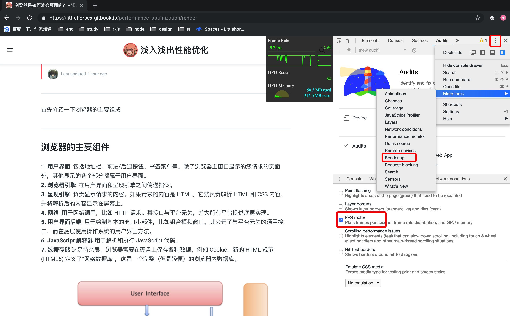

FPS ---- 动画帧率
  
我们知道，动画其实是由一帧一帧的图像构成的。有 Web 动画那么就会存在该动画在播放运行时的帧率。而帧率在不同设备不同情况下又是不一样的。

有的时候，一些复杂或者重要动画，我们需要实时监控它们的帧率，或者说是需要知道它们在不同设备的运行状况，从而更好的优化它们，本文就是介绍 Web 动画帧率（FPS）计算方法。

### 流畅动画的标准

我们平时所看到的连续画面都是由一幅幅静止画面组成的，每幅画面称为一帧，FPS 表示的是每秒钟画面更新次数。

理论上说，FPS 越高，动画会越流畅，目前大多数设备的屏幕刷新率为 60 次/秒，所以通常来讲 FPS 为 60 frame/s 时动画效果最好，也就是每帧的消耗时间为 16.67ms。

> 当然，经常玩 FPS 游戏的朋友肯定知道，吃鸡/CSGO 等 FPS 游戏推荐使用 144HZ 刷新率的显示器，144Hz 显示器特指每秒的刷新率达到 144Hz 的显示器。相较于普通显示器每秒60的刷新速度，画面显示更加流畅。因此144Hz显示器比较适用于视角时常保持高速运动的第一人称射击游戏。 不过，这个只是显示器提供的高刷新率特性，对于我们 Web 动画而言，是否支持还要看浏览器，而大多数浏览器刷新率为 60 次/秒。

直观感受，不同帧率的体验：

* 帧率能够达到 50 ～ 60 FPS 的动画将会相当流畅，让人倍感舒适；
* 帧率在 30 ～ 50 FPS 之间的动画，因各人敏感程度不同，舒适度因人而异；
* 帧率在 30 FPS 以下的动画，让人感觉到明显的卡顿和不适感；
* 帧率波动很大的动画，亦会使人感觉到卡顿。

那么我们该如何准确的获取我们页面动画当前的 FPS 值呢？

### Web端：借助 Chrome 开发者工具



### 技术方法：借助 Frame Timing API

兼容性不好...还需要学习各种api balabala...暂时忽略，我们把不可多得的精力放在下一个方法上就好了。

### 重点方法：借助 requestAnimationFrame API

window.requestAnimationFrame\(\) 这个方法是用来在页面重绘之前，通知浏览器调用一个指定的函数。这个方法接受一个函数为参，该函数会在重绘前调用。

正常而言 requestAnimationFrame 这个方法在一秒内会执行 60 次，也就是不掉帧的情况下。假设动画在时间 A 开始执行，在时间 B 结束，耗时 x ms。而中间 requestAnimationFrame 一共执行了 n 次，则此段动画的帧率大致为：n / \(B - A\)。

因此，我们统计1s内，requestAnimationFrame一共执行了多少次，就可以得出页面的帧率。

```javascript
const rAF = function () {
    return (window.requestAnimationFrame ||
        window.webkitRequestAnimationFrame ||
        function () {
            console.log('1')
            return setTimeout(callback, 1000/60)
        }
    )
}()

let frame = 0
let lastTime = Date.now()
let lastFrameTime = lastTime


function loop () {
    let now = Date.now()
    lastFrameTime = now
    frame++
    if (now - lastTime > 1000) {
        var fps = Math.round((frame * 1000) / (now - lastTime));
        console.log(`${new Date()} 1S内 FPS：`, fps);
        frame = 0;
        lastTime = now;
    }
    rAF(loop)
}

loop()
```

