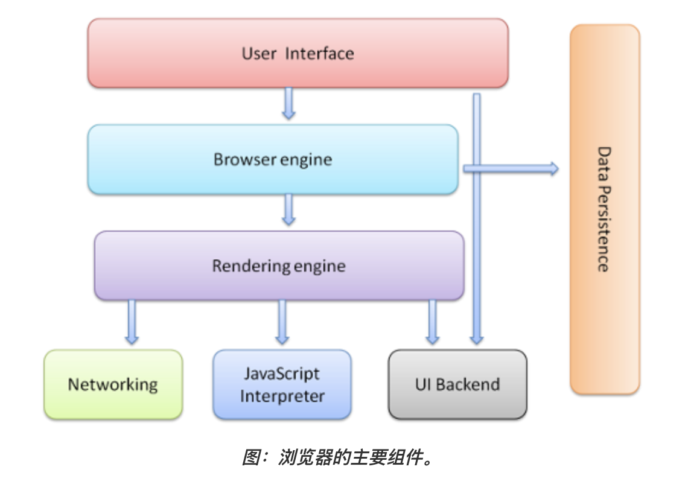
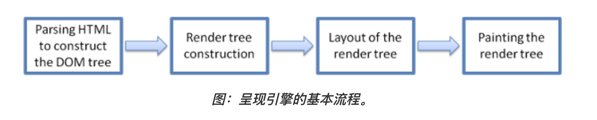
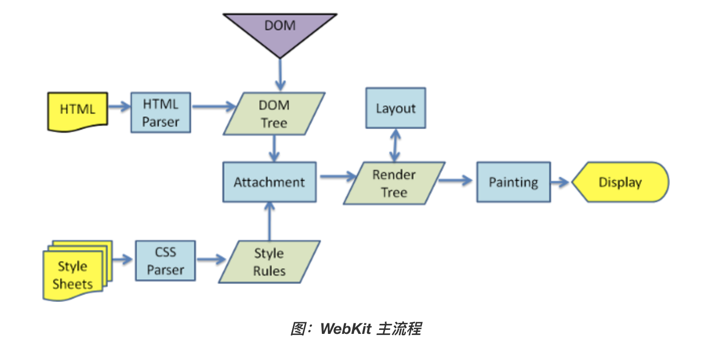
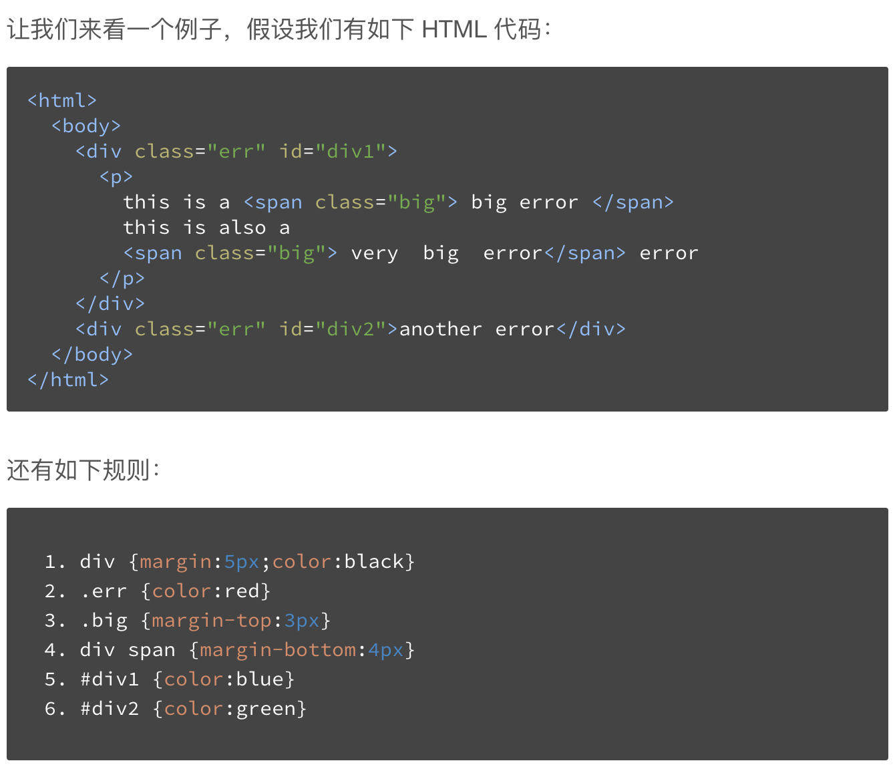
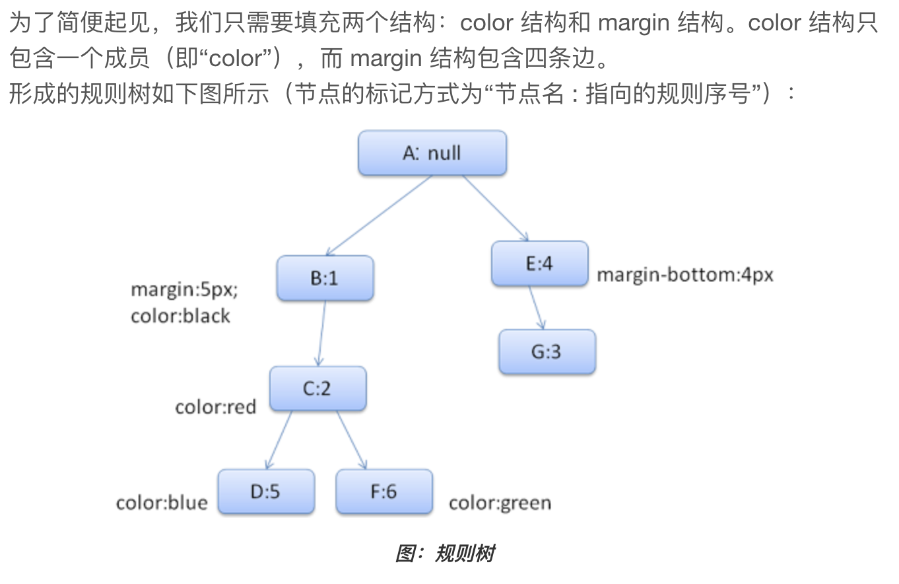
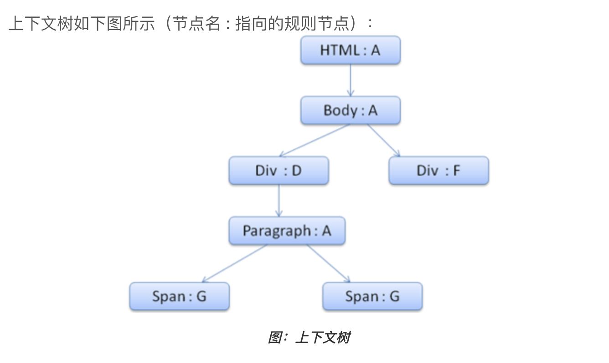
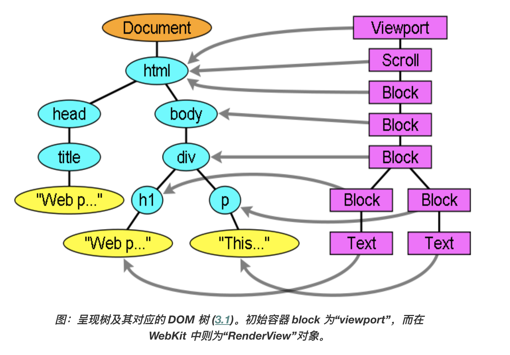

首先介绍一下浏览器的主要组成

## 浏览器的主要组件

**1. 用户界面**  包括地址栏、前进/后退按钮、书签菜单等。除了浏览器主窗口显示的您请求的页面外，其他显示的各个部分都属于用户界面。  
**2. 浏览器引擎**  在用户界面和呈现引擎之间传送指令。  
**3. 呈现引擎**  负责显示请求的内容。如果请求的内容是 HTML，它就负责解析 HTML 和 CSS 内容，并将解析后的内容显示在屏幕上。  
**4. 网络**  用于网络调用，比如 HTTP 请求。其接口与平台无关，并为所有平台提供底层实现。  
**5. 用户界面后端**  用于绘制基本的窗口小部件，比如组合框和窗口。其公开了与平台无关的通用接口，而在底层使用操作系统的用户界面方法。  
**6. JavaScript 解释器** 用于解析和执行 JavaScript 代码。  
**7. 数据存储** 这是持久层。浏览器需要在硬盘上保存各种数据，例如 Cookie。新的 HTML 规范 \(HTML5\) 定义了“网络数据库”，这是一个完整（但是轻便）的浏览器内数据库。



FE主要当然是了解呈现引擎部分就好了，因此下面只介绍呈现引擎的工作。

## 呈现引擎主流程

呈现引擎一开始会从网络层获取请求文档的内容，通常以8K分块的方式完成，然后进行如下所示的基本流程：



解析html以构建dom树 -&gt; 构建render树 -&gt; 布局render树 -&gt; 绘制render树

呈现引擎将开始解析 HTML 文档，并将各标记逐个转化成“内容树”上的 `DOM` 节点。同时也会解析外部 `CSS` 文件以及样式元素中的样式数据。HTML 中这些带有视觉指令的样式信息将用于创建另一个树结构：呈现树。

`呈现树`包含多个带有视觉属性（如颜色和尺寸）的矩形。这些矩形的排列顺序就是它们将在屏幕上显示的顺序。

呈现树构建完毕之后，进入`布局`处理阶段，也就是为每个节点分配一个应出现在屏幕上的确切坐标。

下一个阶段是`绘制` - 呈现引擎会遍历呈现树，由用户界面后端层将每个节点绘制出来。

需要着重指出的是，这是一个渐进的过程。为达到更好的用户体验，呈现引擎会力求尽快将内容显示在屏幕上。它不必等到整个 HTML 文档解析完毕之后，就会开始构建呈现树和设置布局。在不断接收和处理来自网络的其余内容的同时，呈现引擎会将部分内容解析并显示出来。  




下面详细介绍一下这几个阶段：

### 解析

在这一篇不多做介绍，可以看[《番外篇：编译解析原理》](extra/compile.md)

### 生成DOM树

将HTML解析出DOM（Object Model）Tree，DOM 树的构建过程是一个深度遍历过程：当前节点的所有子节点都构建好后才会去构建当前节点的下一个兄弟节点。

### 生成CSS Rule树

CSS解析出CSSOM（也叫 Style Rules）Tree







### Javascript代码处理

JavaScript代码由JavaScript引擎处理。  
浏览器解析文档，当遇到script标签的时候，会立即解析脚本，停止解析文档（因为JS可能会改动DOM和CSS，所以继续解析会造成浪费）。  
如果脚本是外部的，会等待脚本下载完毕，再继续解析文档。现在可以在script标签上增加属性 defer或者async。脚本解析会将脚本中改变DOM和CSS的地方分别解析出来，追加到DOM Tree和Style Rules上。

### 生成呈现/渲染树（RenderObject Tree）

在 DOM 树构建的同时，浏览器还会构建另一个树结构：呈现树。这是由可视化元素按照其显示顺序而组成的树，也是文档的可视化表示。它的作用是让您按照正确的顺序绘制内容。

每一个呈现器都代表了一个矩形的区域，通常对应于相关节点的 CSS 框，这一点在 CSS2 规范中有所描述。它包含诸如宽度、高度和位置等几何信息。   
框的类型会受到与节点相关的“display”样式属性的影响。

呈现器是和 DOM 元素相对应的，但并非一一对应。非可视化的 DOM 元素不会插入呈现树中，例如“head”元素。如果元素的 display 属性值为“none”，那么也不会显示在呈现树中（但是 visibility 属性值为“hidden”的元素仍会显示）。



### 布局 Layout（回流 Reflow\)

创建渲染树后，浏览器已经能知道网页中有哪些节点、各个节点的CSS定义以及他们的从属关系。下一步就是布局，或者叫回流。

这个过程就是通过渲染树中渲染对象的信息，计算出每一个渲染对象的位置和尺寸，将其安置在浏览器窗口的正确位置。

而有些时候我们会在文档布局完成后对DOM进行修改（元素的尺寸、结构或者触发某些属性时），这时候可能需要重新进行计算布局，也可称其为回流，本质上还是一个布局的过程。

reflow 几乎是无法避免的。现在界面上流行的一些效果，比如树状目录的折叠、展开（实质上是元素的显 示与隐藏）等，都将引起浏览器的 reflow。鼠标滑过、点击……只要这些行为引起了页面上某些元素的占位面积、定位方式、边距等属性的变化，都会引起它内部、周围甚至整个页面的重新渲 染。通常我们都无法预估浏览器到底会 reflow 哪一部分的代码，它们都彼此相互影响着。

### 绘制 Paint（重绘 Repaint\)

在绘制阶段，系统会遍历呈现树，并调用呈现器的“paint”方法，将呈现器的内容显示在屏幕上。绘制工作是使用用户界面基础组件完成的，依赖2D和3D图形库渲染成图像结果呈现在浏览器中（Painting）。

本质上就是填充像素的过程。包括绘制文字、颜色、图像、边框和阴影等，也就是一个 DOM 元素所有的可视效果。一般来说，这个绘制过程是在多个层上完成的。

CSS2 规范定义了绘制流程的顺序。绘制的顺序其实就是元素进入堆栈样式上下文的顺序。这些堆栈会从后往前绘制，因此这样的顺序会影响绘制。块呈现器的堆栈顺序如下：

1. 背景颜色
2. 背景图片
3. 边框
4. 子代
5. 轮廓

### **Composite 合并**

由上一步可知，对页面中 DOM 元素的绘制是在多个层上进行的。在每个层上完成绘制过程之后，浏览器会将所有层按照合理的顺序合并成一个图层，然后显示在屏幕上。对于有位置重叠的元素的页面，这个过程尤其重要，因为一旦图层的合并顺序出错，将会导致元素显示异常。

### **回流和重绘**

Reflow的成本比Repaint的成本高得多的多。DOM Tree里的每个结点都会有reflow方法，一个结点的reflow很有可能导致子结点，甚至父点以及同级结点的reflow。在一些高性能的电脑上也许还没什么，但是如果reflow发生在手机上，那么这个过程是非常痛苦和耗电的。

所以，下面这些动作有很大可能会是成本比较高的。

* 当你增加、删除、修改DOM结点时，会导致Reflow或Repaint

* 当你移动DOM的位置，或是搞个动画的时候。

* 当你修改CSS样式的时候。

* 当你Resize窗口的时候（移动端没有这个问题），或是滚动的时候。

* 当你修改网页的默认字体时。


注：display:none会触发reflow，而visibility:hidden只会触发repaint，因为没有发现位置变化。
  
基本上来说，reflow有如下的几个原因：

* Initial。网页初始化的时候。

* Incremental。一些Javascript在操作DOM Tree时。

* Resize。其些元件的尺寸变了。

* StyleChange。如果CSS的属性发生变化了。

* Dirty。几个Incremental的reflow发生在同一个frame的子树上。


举个例子：

```
var bstyle = document.body.style; // cache
 
bstyle.padding = "20px"; // reflow, repaint
bstyle.border = "10px solid red"; //  再一次的 reflow 和 repaint
 
bstyle.color = "blue"; // repaint
bstyle.backgroundColor = "#fad"; // repaint
 
bstyle.fontSize = "2em"; // reflow, repaint
 
// new DOM element - reflow, repaint
document.body.appendChild(document.createTextNode('dude!'));
```

当然，我们的浏览器是聪明的，它不会像上面那样，你每改一次样式，它就reflow或repaint一次。一般来说，浏览器会把这样的操作积攒一批，然后做一次reflow，这又叫异步reflow或增量异步reflow。但是有些情况浏览器是不会这么做的，比如：resize窗口，改变了页面默认的字体，等。对于这些操作，浏览器会马上进行reflow。

当元素样式的改变不影响布局时，浏览器将使用重绘对元素进行更新，此时由于只需要 UI 层面的重新像素绘制，因此损耗较少。


