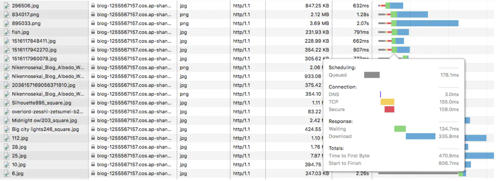

HTTP/2协议在2015年就已经正式被发表了，但是现在有许多网站还是采用的http/1.1协议，那么它们的区别是什么呢，2.0版本有什么改进/优势呢？

## HTTP/1.1 缺点

### 1. TCP 连接数限制

对于同一个域名，浏览器最多只能同时创建 6~8 个 TCP 连接 (不同浏览器不一样)。为了解决数量限制，出现了 域名分片 技术，其实就是资源分域，将资源放在不同域名下 (比如二级子域名下)，这样就可以针对不同域名创建连接并请求，以一种讨巧的方式突破限制，但是滥用此技术也会造成很多问题，比如每个 TCP 连接本身需要经过 DNS 查询、三步握手、慢启动等，还占用额外的 CPU 和内存，对于服务器来说过多连接也容易造成网络拥挤、交通阻塞等

### 2. 线头阻塞 (Head Of Line Blocking) 问题
每个 TCP 连接同时只能处理一个请求 - 响应，浏览器按 FIFO 原则处理请求，如果上一个响应没返回，后续请求 - 响应都会受阻。为了解决此问题，出现了 管线化 - pipelining 技术，但是管线化存在诸多问题，比如第一个响应慢还是会阻塞后续响应、服务器为了按序返回相应需要缓存多个响应占用更多资源、浏览器中途断连重试服务器可能得重新处理多个请求、还有必须客户端 - 代理 - 服务器都支持管线化

### 3. Header 内容多，而且每次请求 Header 不会变化太多，没有相应的压缩传输优化方案

### 4. 明文传输不安全

基于以上缺点，也出现了许多优化手段：为了尽可能减少请求数，做一些合并文件、雪碧图、资源内联等优化工作，但是这无疑造成了单个请求内容变大延迟变高的问题，且内嵌的资源不能有效地使用缓存机制

## HTTP/2 优势

### 1. 二进制分帧层 (Binary Framing Layer)

帧是数据传输的最小单位，以二进制传输代替原本的明文传输，原本的报文消息被划分为更小的数据帧

h1 和 h2 的报文对比:

图中 h2 的报文是重组解析过后的，可以发现一些头字段发生了变化，而且所有头字段均小写

> `strict-transport-security: max-age=63072000; includeSubdomains` 字段是服务器开启 HSTS 策略，让浏览器强制使用 HTTPS 进行通信，可以减少重定向造成的额外请求和会话劫持的风险

> 服务器开启 HSTS 的方法是: 以 nginx 为例，在相应站点的 server 模块中添加 `add_header Strict-Transport-Security "max-age=63072000; includeSubdomains" always;` 即可

> 在 Chrome 中可以打开 `chrome://net-internals/#hsts` 进入浏览器的 HSTS 管理界面，可以增加 / 删除 / 查询 HSTS 记录，比如下图:

> 

> 在 HSTS 有效期内且 TLS 证书仍有效，浏览器访问 blog.wangriyu.wang 会自动加上 https:// ，而不需要做一次查询重定向到 https

### 2. 多路复用 (MultiPlexing)

在一个 TCP 连接上，我们可以向对方不断发送帧，每帧的 stream identifier 的标明这一帧属于哪个流，然后在对方接收时，根据 stream identifier 拼接每个流的所有帧组成一整块数据。

HTTP/2 复用 TCP 连接，在一个连接里，客户端和浏览器都可以同时发送多个请求或回应，把 HTTP/1.1 每个请求都当作一个流（stream），那么多个请求变成多个流，请求响应数据分成多个帧（Frame），不同流中的帧交错地发送给对方（但是同一个请求或响应的帧必须是有序的，不同的可以无序），这就是 HTTP/2 中的多路复用。

流的概念实现了单连接上多请求 - 响应并行，解决了线头阻塞的问题，减少了 TCP 连接数量和 TCP 连接慢启动造成的问题。http2还可以对stream指定优先级，优先级越高的越先响应。比如可以把js和css的优先级设置的高一些，让他们优先下载并执行。优先级也能动态的修改。

所以 http2 对于同一域名只需要创建一个连接，而不是像 http/1.1 那样创建 6~8 个连接:

### 3. 头部压缩

HTTP是无状态的，每次请求都需要附带一些信息。但是许多字段都是重复的，会浪费带宽影响速度。
HTTP/2对头部信息采用HPACK压缩算法来减少报文头的大小。具体做法是把报文头信息中常见的名和值对应一个索引，维护了一张静态字典，index从1到61，比如把：method:GET映射成2，这样就能达到压缩头部的作用。但是对于一些动态的资源，比如，user-agent，需要维护一份可动态添加内容的共同动态字典，这份动态字典在数据传输的过程中逐步建立，index从62开始。然后将映射之后的数据用huffman编码。

### 4、服务端推送

以前是客户端向服务器请求什么，服务器就发送什么，十分吝啬。现在有了服务端推送，客户端向服务端要了一滴水，服务端可以返回整个森林。
这允许服务器直接提供浏览器渲染页面所需资源，而无须浏览器在收到、解析页面后再提起一轮请求，节约了加载时间。比如浏览器向服务器请求一个页面，之前需要等到浏览器收到页面解析html后，发现里面引用了静态资源，浏览器再向服务器发送静态资源的请求。但是现在服务器可以直接将页面和所需的静态资源一并返回。
服务端推送需要开发人员手动配置，之前介绍的多路复用、头部header压缩这两项浏览器和服务器可以自行实现，不需要开发人员关心。

### 5、nginx如何配置
server {
    listen 443 ssl http2;
}

合并文件、内联资源、雪碧图、域名分片对于 HTTP/2 来说是不必要的，使用 h2 尽可能将资源细粒化，文件分解地尽可能散，不用担心请求数多
