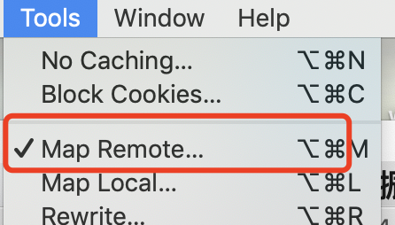
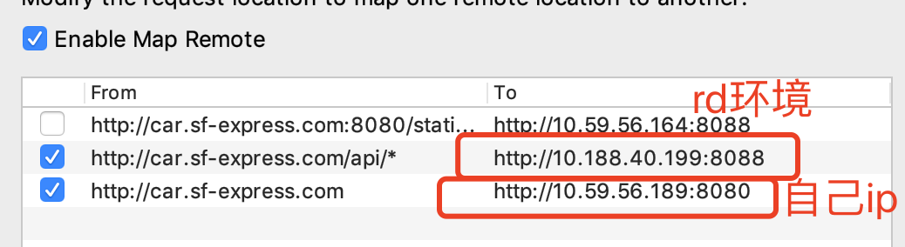
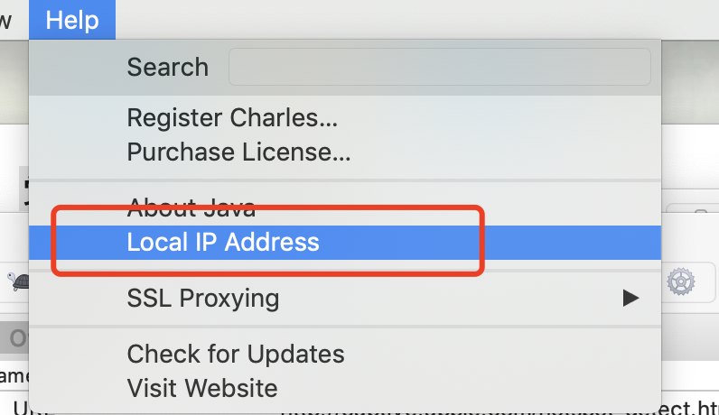
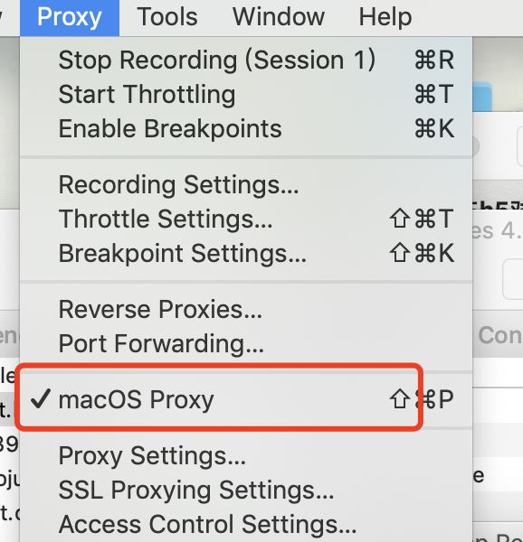
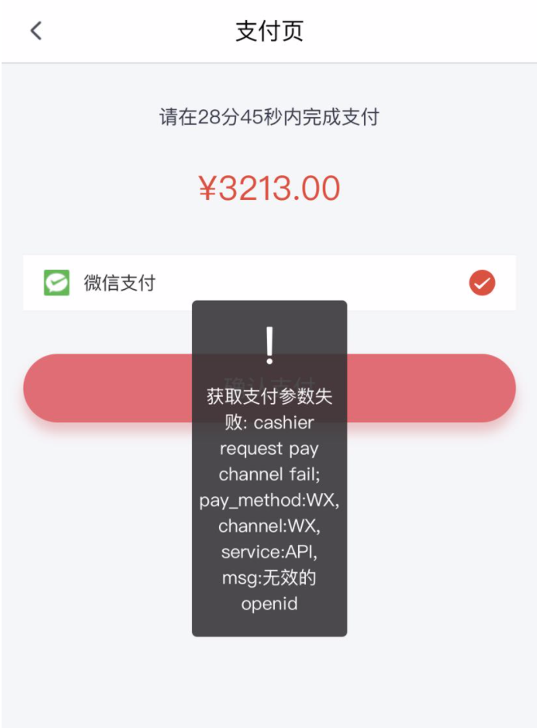
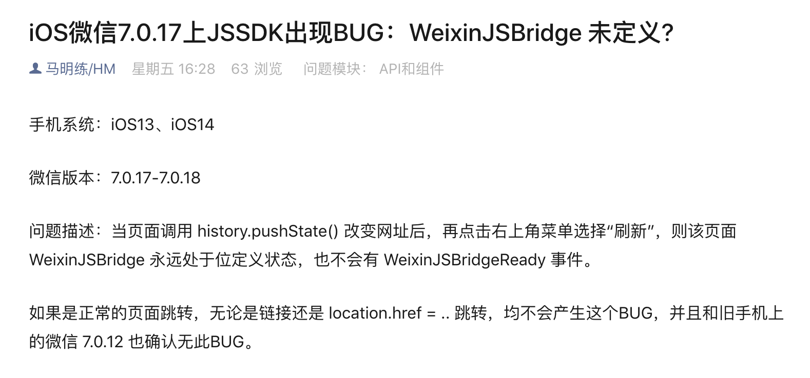
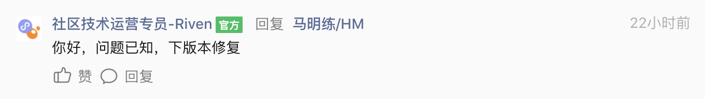

虽然是h5，但是细分有两种：微信内打开h5、浏览器打开h5，这两种h5对接两种微信支付方式
如果 微信内打开h5 也使用 浏览器打开h5 调用微信支付的方式，微信会报错误页：请在微信外打开订单进行支付


## 浏览器h5

#### 1. 进到支付页的时候调用Prepay接口
#### 2. 真正去支付的时候调用PayParams接口，打开接口返回的h5链接就会自动跳转到微信的支付页面


## 微信内第三方h5 — JSAPI支付

#### 1. jsApi支付需要先获取openid，所以需要先配置一些环境以支持获取

openId是用户在当前公众号下的唯一标识

> 扩展 unionId 一个商家如果有多个公众号，一个用户就会对应三个openid，但是一个用户在同一微信开放平台下的不同应用，unionid是相通的

还需要appSecret：开发者密钥，直接在微信平台里管理员账号查看就可以

注：配置域名最好一次性配置好uat online http https，要不然和业务要管理员权限很麻烦

1.	在微信支付商户平台-->产品中心-->开发配置   配置 h5支付域名（需要管理员账号）
2.	微信公众号平台—>开发—>接口配置—>网页服务—>网页授权   配置 网页授权域名 （不需要配http https）（需要rd把微信的一个txt文件传到webroot下）（需要管理员账号）
3.	（如果第4步还不行配置）JS接口安全域名 （和第一步的在一起）
4.	前三步完成后，用草料二维码生成二维码地址 https://cli.im/（用于微信扫码）（appid和rediret_url需要更换）(scope设置为snsapi_base为静默授权 只用于获取openid，snsapi_userinfo为非静默 可以获取openid 用户头像 昵称)  https://open.weixin.qq.com/connect/oauth2/authorize?appid=wx797efa46dbb71afa&redirect_uri=http://car.sf-express.com/h5&response_type=code&scope=snsapi_base&state=1#wechat_redirect
5.	用户通过上面的链接，微信会回调我们的业务链接（也就是配置的rediret_url），并且拼接一个code给url
6.	前端判断是 微信h5时，getUrlParam（文末有现成的工具函数）获取url里的code
7.	把code传给后端（因为公众号的一些信息安全级别很高，所以最好保存在服务端），后端调用wx服务获取openid
8.	后端调用的微信服务地址为  https://api.weixin.qq.com/sns/oauth2/access_token?appid=APPID&secret=SECRET&code=CODE&grant_type=authorization_code （大写的字段需要更改，code为前端传的）
9.	还需要在产品中心-开发配置，配置支付授权路径，要不然在最后支付输入密码后，会报错“微信公众号支付出现：“当前页面的URL未注册””

#### 2 调用Prepay接口，把openid传进去，获取参数

#### 3 真正去支付的时候，先调用PayParams（注意pay_method区分）获取到需要传给微信的参数，再按照最后的微信内H5调起支付方式调起支付（需要注意的是timeStamp要转成字符串）

> 网上的一篇较详细教程 https://blog.csdn.net/qq_35430000/article/details/79299529

线下如果代理到Https，会因为没证书导致不能在微信内打开，以上都是按照http来的


## 线下调试

因为支付对安全要求比较高，所以访问支付的域名必须要和后台配置的某个域名一样（如果不一致，微信会报错误页）（一般情况下就是线上域名，需要什么工商注册过的），所以线下就需要charles代理（建议关闭vue.config.js里的proxy代理）
此外，线下手机调试请用Vconsole，非常方便

#### 1 配置代理




自己的电脑ip也可以在charles看



#### 2 记得电脑连vpn，手机和电脑连同一个wifi，然后手机配置代理到电脑ip 8888端口

#### 3 如果需要电脑也走代理，勾一下


#### 4 草料二维码 扫码就行了 https://cli.im/


## 微信官方文档相关链接（访问需要断开vpn）

[网页获取openid](https://developers.weixin.qq.com/doc/offiaccount/OA_Web_Apps/Wechat_webpage_authorization.html)
[授权开发步骤开发步骤](https://pay.weixin.qq.com/wiki/doc/api/jsapi.php?chapter=7_3)
[微信内H5调起支付](https://pay.weixin.qq.com/wiki/doc/api/jsapi.php?chapter=7_7&index=6)
[浏览器h5调用微信支付常见报错问题](https://pay.weixin.qq.com/wiki/doc/api/H5.php?chapter=15_4)

```js
// 获取页面url的参数工具
const getUrlParam = (key) => {
  const reg = new RegExp(`(^|&)${key}=([^&]*)(&|$)`);
  const paramsLi = window.location.search.substr(1).match(reg);
  if (paramsLi !== null && paramsLi !== '' && paramsLi !== undefined) {
    const param = unescape(paramsLi[2]);
    return param;
  }
  return ''
}
```

```js
// 微信h5调用支付函数
window.WeixinJSBridge.invoke(
  'getBrandWCPayRequest', {
    appId: 'wx2421b1c4370ec43b', // 公众号名称，由商户传入
    timeStamp: '1395712654', // 时间戳，自1970年以来的秒数
    nonceStr: 'e61463f8efa94090b1f366cccfbbb444', // 随机串
    package: 'prepay_id=u802345jgfjsdfgsdg888',
    signType: 'MD5', //微信签名方式
    paySign: '70EA570631E4BB79628FBCA90534C63FF7FADD89' // 微信签名
  },
  function(res){
    if(res.err_msg === 'get_brand_wcpay_request:ok'){
      // 使用以上方式判断前端返回,微信团队郑重提示：
      //res.err_msg将在用户支付成功后返回ok，但并不保证它绝对可靠。
    } 
  }
);
```

### 问题1

**问题描述：**
因为h5可能在微信和手机浏览器打开，所以需要统一链接或二维码，而现在微信h5的配置是open.weixin.qq.com....

**解决方案：**
判断当前是微信浏览器，且链接里没有code，且localstorage里没有openid时，自动跳转到下面链接
```js
window.location.href = `https://open.weixin.qq.com/connect/oauth2/authorize?appid=wx797efa46dbb71afa&redirect_uri=${window.location.href}&response_type=code&scope=snsapi_base&state=1#wechat_redirect`
```


### 问题2

**问题描述：**
用户在微信内手动刷新支付页之后点支付，页面报错


**问题原因：**
报错直接原因：获取prepay信息的时候，没给后端传openid
缺失openid原因：前端使用window.WeixinJSBridge来判断是否是微信浏览器，判断为微信浏览器才会传openid，但有时页面刷新后微信会获取不到WeixinJSBridge，导致虽然理论上是微信浏览器，但判断为了不是
缺失WeixinJSBridge原因：如下图 来自[微信开放社区](https://developers.weixin.qq.com/community/develop/doc/00086260ecc9e0efd22b8ebd451800?highLine=WeixinJSBridge)




**解决方案：**

1. 统一用以下方式判断是否为微信浏览器
```js
function isWX() {
  const ua = window.navigator.userAgent.toLowerCase();
  if (ua.includes('micromessenger')) {
    return true; // 是微信端
  }
  return false;
}
```
2. 跳转支付页统一改为`window.location.href=xxx`，弃用`router.push`
3. 上面跳转方式的修改可能会导致一些数据保存的问题，需要留意一下

