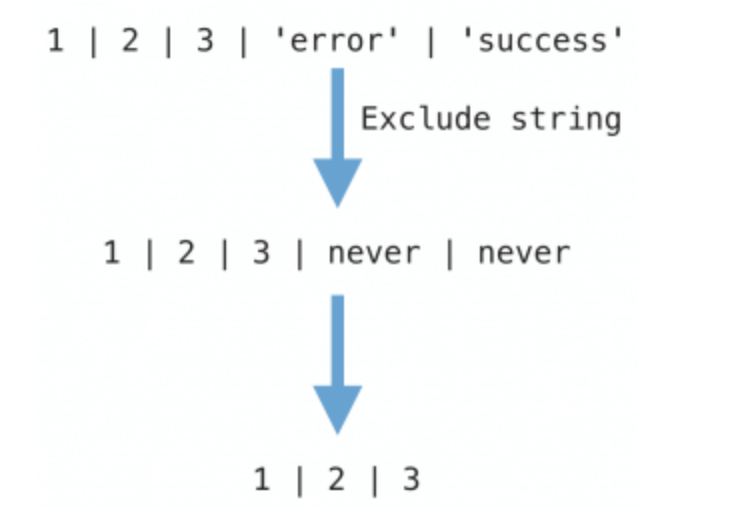

## typescript定位

- JavaScript 的超集
- 编译期行为
- 不改变运行时行为
- 始终与 ESMAScript 语言标准一致 (stage 3 语法)
- 提供约束

> TypeScript中的Decorator较为特殊，为Angular团队和TypeScript团队交易的结果，有兴趣可自行搜索相关资料。。而且近期 EcmaScript 规范中的 decorator 提案内容发生了剧烈变动，建议等此语法标准完全稳定后再在生产项目中使用。

## typescript内置类型

### Partial

`Partial<T>` 的作用就是将某个类型 `T` 里的属性全部变为可选项 `?`。

```ts
type Partial<T> = {
    [P in keyof T]?: T[P];
};
```

在以上代码中，首先通过 `keyof T` 拿到 `T` 的所有属性名，然后使用 `in` 进行遍历，将值赋给 `P`，最后通过 `T[P]` 取得相应的属性值。中间的 `?` 号，用于将所有属性变为可选。

使用场景：
```ts
// 账号属性
interface AccountInfo {
    name: string 
    email: string 
    age: number 
    vip: 0|1 // 1 是vip ，0 是非vip
}

// 当我们需要渲染一个账号表格时，我们需要定义
const accountList: AccountInfo[] = []

// 但当我们需要查询过滤账号信息，需要通过表单，
// 但明显我们可能并不一定需要用到所有属性进行搜索，此时可以定义
const model: Partial<AccountInfo> = {
  name: '',
  vip: undefind
}
```

```ts
interface Todo {
  title: string;
  description: string;
}

function updateTodo(todo: Todo, fieldsToUpdate: Partial<Todo>) {
  return { ...todo, ...fieldsToUpdate };
}

const todo1 = {
  title: "Learn TS",
  description: "Learn TypeScript",
};

const todo2 = updateTodo(todo1, {
  description: "Learn TypeScript Enum",
});
```

### Required
与 Partial 相反，Required 将类型 T 的所有属性标记为必选属性。
```ts
type Required<T> = {
    [P in keyof T]: T[P];
};
```

### Readonly
将所有属性标记为 readonly, 即不能修改。
```ts
type Readonly<T> = {
    readonly [P in keyof T]-?: T[P];
};
```

### Pick<T, K>
从 T 中过滤出属性 K
```ts
type Pick<T, K extends keyof T> = {
    [P in K]: T[P];
};
```
使用场景:
```ts
interface AccountInfo {
  name: string 
  email: string 
  age: number 
  vip?: 0|1 // 1 是vip ，0 是非vip
}

type CoreInfo = Pick<AccountInfo, 'name' | 'email'>
/* 
{ 
  name: string
  email: stirng
}
*/
```

### Exclude<T, U>，Omit<T, K>
移除 T 中的 U 属性
```ts
type Exclude<T, U> = T extends U ? never : T;
```
使用场景：
```ts
// 'a' | 'd'
type A = Exclude<'a'|'b'|'c'|'d' ,'b'|'c'|'e' >  
// 乍一看好像这个没啥卵用，但是，我们通过一番操作，之后就可以得到 Pick 的反操作：
type Omit<T, K extends keyof T> = Pick<T, Exclude<keyof T, K>>

type NonCoreInfo = Omit<AccountInfo, 'name' | 'email'>
/*
{
  age: number 
  vip: 0|1,
}
*/
```

### Extract<T, U>
Exclude 的反操作，取 T，U两者的交集属性。

```ts
type Extract<T, U> = T extends U ? T : never;
```

使用 demo：

```ts
// 'b'|'c'
type A = Extract<'a'|'b'|'c'|'d' ,'b'|'c'|'e' >  
```

### Record<K, T>
标记对象的 key value类型
```ts
type Record<K extends keyof any, T> = {
    [P in K]: T;
};
```

使用场景:

```ts
// 定义 学号(key)-账号信息(value) 的对象
const accountMap: Record<number, AccountInfo> = {
  10001: {
    name: 'xx',
    email: 'xxxxx',
    // ...
  }    
}
const user: Record<'name'|'email', string> = {
    name: '', 
    email: ''
}
// 复杂点的类型推断
function mapObject<K extends string | number, T, U>(obj: Record<K, T>, f: (x: T) => U): Record<K, U>

const names = { foo: "hello", bar: "world", baz: "bye" };
// 此处推断 K, T 值为 string , U 为 number
const lengths = mapObject(names, s => s.length);  // { foo: number, bar: number, baz: number }
```


### NonNullable
排除类型 T 的 null | undefined 属性
```ts
type NonNullable<T> = T extends null | undefined ? never : T;
```
使用 demo
```ts
type A = string | number | undefined 
type B = NonNullable<A> // string | number

function f2<T extends string | undefined>(x: T, y: NonNullable<T>) {
    let s1: string = x;  // Error, x 可能为 undefined
    let s2: string = y;  // Ok
}
```

### Parameters
获取一个函数的所有参数类型
```ts
// 此处使用 infer P 将函数参数定为待推断类型
// T 符合函数特征时，返回参数类型，否则返回 never
type Parameters<T extends (...args: any) => any> = T extends (...args: infer P) => any ? P : never;
```
使用demo:
```ts
interface IFunc {
  (person: IPerson, count: number): boolean
}

type P = Parameters<IFunc> // [IPerson, number]

const person01: P[0] = {
  // ...
}
```
另一种使用场景是，快速获取未知函数的参数类型：
```ts
import {somefun} from 'somelib'
// 从其他库导入的一个函数，获取其参数类型
type SomeFuncParams = Parameters<typeof somefun>

// 内置函数
// [any, number?, number?]
type FillParams = Parameters<typeof Array.prototype.fill>
```

### ConstructorParameters
类似于 Parameters<T>, ConstructorParameters 获取一个类的构造函数参数
```ts
type ConstructorParameters<T extends new (...args: any) => any> = T extends new (...args: infer P) => any ? P : never;
```
使用 demo:
```ts
// string | number | Date 
type DateConstrParams = ConstructorParameters<typeof Date>
```


### ReturnType
获取函数类型的返回类型
```ts
type ReturnType<T extends (...args: any) => any> = T extends (...args: any) => infer R ? R : any;
```
使用方式和 Parameters<T> 类似，不再赘述

### InstanceType
获取一个类的返回类型
```ts
type InstanceType<T extends new (...args: any) => any> = T extends new (...args: any) => infer R ? R : any;
```
使用方式和 ConstructorParameters<T> 类似，不再赘述


## never
never 是 | 运算的幺元，即 x | never = x。例如之前的 Exclude<Result, string> 运算过程如下：



## declare
在实际应用开发时有一种场景，当前作用域下可以访问某个变量，但这个变量并不由开发者控制。例如通过 Script 标签直接引入的第三方库 CDN、一些宿主环境的 API 等。这个时候可以利用 TS 的环境声明功能，来告诉 TS 当前作用域可以访问这些变量，以获得类型提醒。

具体有两种方式，declare 和三斜线指令。
```ts
declare const IS_MOBILE = true;    // 编译后此行消失
const wording = IS_MOBILE ? '移动端' : 'PC端';
```

用三斜线指令可以一次性引入整个类型声明文件。
```ts
/// <reference path="../typings/monaco.d.ts" />
const range = new monaco.Range(2, 3, 6, 7);
```

## interface 和 type

interface 和 type 两个关键字因为其功能比较接近，常常引起新手的疑问：应该在什么时候用 type，什么时候用 interface？
interface 的特点如下：

- 同名 interface 自动聚合，也可以和已有的同名 class 聚合，适合做 polyfill
- 自身只能表示 object/class/function 的类型

建议库的开发者所提供的公共 api 应该尽量用 interface/class，方便使用者自行扩展。

与 interface 相比，type 的特点如下：

- 表达功能更强大，不局限于 object/class/function
- 要扩展已有 type 需要创建新 type，不可以重名
- 支持更复杂的类型操作


## 练习

### 1. 提取一个object的function key

如何得到 'c' | 'd' ？ 
```ts
interface SomeProps {
    a: string
    b: number
    c: (e: MouseEvent) => void
    d: (e: TouchEvent) => void
}
```
解答：
```ts
type TGetFuncKeys<T> = {
  [K in keyof T]: T[K] extends Function ? K : never
}[keyof T]
type FuncKeys = TGetFuncKeys<SomeProps> // 'c' | 'd'
```
这里的运算过程如下：
```js
// 开始
{
  a: string,
  b: number,
  c: (e: MouseEvent) => void,
  d: (e: TouchEvent) => void
}
// 第一步，条件映射
{
  a: never,
  b: never,
  c: 'c',
  d: 'd'
}
// 第二步，索引取值
never | never | 'c' | 'd'
// never的性质
'c' | 'd'
```

### 2. tuple 转 union

```ts
typeof TTuple = [string, number]

typeof ElementOf<T> = T extends Array<infer P> ? P : never
typeof TUnion = ElementOf<TTuple>
```

### 3. 从输入输出推断函数类型
假设现在有一个这样的类型：
```ts
interface Module {
  count: number;
  message: string;
  asyncMethod<T, U>(input: Promise<T>): Promise<Action<U>>;
  syncMethod<T, U>(action: Action<T>): Action<U>;
}
```
经过connect之后，返回的值类型为：
```ts
interface Result {
  asyncMethod<T, U>(input: T): Action<U>;
  syncMethod<T, U>(action: T): Action<U>;
}
```
其中Action<T>的定义为
```ts
interface Action<T> {
  payload?: T,
  type: string
}
```
推测connect的类型

```ts
type FuncName<T> = {
  [K in typeof T]: T[K] extends Function ? K : never
}[keyof T]
type Connect = (module: Module) => { [T in keyof FuncName]: Module<T> }
```
