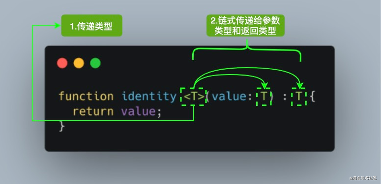

## 泛型是什么

类型实际上可以进行一定的运算，要想写出的类型适用范围更广，不妨让它像函数一样可以接受参数。TS 的泛型便是起到这样的作用，你可以把它当作类型的参数。它和函数参数一样，可以有默认值。除此之外，还可以用 extends 对参数本身需要满足的条件进行限制。

在定义一个函数、type、interface、class 时，在名称后面加上<> 表示即接受类型参数。而在实际调用时，不一定需要手动传入类型参数，TS 往往能自行推断出来。在 TS 推断不准时，再手动传入参数来纠正。

```ts
// 定义
class React.Component<P = {}, S = {}, SS = any> { ... }
interface IShowConfig<P extends IShowProps> { ... }
// 调用
class Modal extends React.Component<IModalProps, IModalState> { ... }
```

## 使用语法

在定义泛型后，有两种方式使用，一种是传入泛型类型，另一种使用类型推断，即编译器根据其他参数类型来推断泛型类型。简单示例如下：
```ts
declare function fn<T>(arg: T): T; // 定义一个泛型函数

const fn1 = fn<string>('hello');  // 第一种方式，传入泛型类型 string
const fn2 = fn(1); // 第二种方式，从参数 arg 传入的类型 number，来推断出泛型 T 的类型是 number
```

对于刚接触 TypeScript 泛型的读者来说，首次看到 `<T>` 语法会感到陌生。其实它没有什么特别，就像传递参数一样，我们传递了我们想要用于特定函数调用的类型。



参考上面的图片，当我们调用 `identity<Number>(1)` ，`Number` 类型就像`参数 1` 一样，它将在出现 T 的任何位置`填充该类型`。图中 <T> 内部的 `T` 被称为`类型变量`，它是我们希望传递给 identity 函数的类型占位符，同时它被分配给 value 参数用来代替它的类型：此时 T 充当的是类型，而不是特定的 Number 类型。

其中 `T` 代表 **Type**，在定义泛型时通常用作第一个类型变量名称。但实际上 T 可以用任何有效名称代替。除了 T 之外，以下是常见泛型变量代表的意思：

- K（Key）：表示对象中的键类型；
- V（Value）：表示对象中的值类型；
- E（Element）：表示元素类型。

其实并不是只能定义一个类型变量，我们可以引入希望定义的任何数量的类型变量。比如我们引入一个新的类型变量 U，用于扩展我们定义的 identity 函数：

```ts
function identity <T, U>(value: T, message: U) : T {
  console.log(message);
  return value;
}

console.log(identity<Number, string>(68, "Semlinker"));
```

除了为类型变量显式设定值之外，一种更常见的做法是使编译器自动选择这些类型，从而使代码更简洁。我们可以完全省略尖括号，比如：

```ts
function identity <T, U>(value: T, message: U) : T {
  console.log(message);
  return value;
}

console.log(identity(68, "Semlinker"));
```

对于上述代码，编译器足够聪明，能够知道我们的参数类型，并将它们赋值给 T 和 U，而不需要开发人员显式指定它们。

## 范型工具类型

为了方便开发者 TypeScript 内置了一些常用的工具类型，比如 Partial、Required、Readonly、Record 和 ReturnType 等。出于篇幅考虑，这里我们只简单介绍 几种 工具类型。

### 1. typeof

用于`获取一个“常量”的类型`，这里的“常量”是指任何可以在编译期确定的东西，例如const、function、class等。它是从 实际运行代码  通向 类型系统 的单行道。理论上，任何运行时的符号名想要为类型系统所用，都要加上 typeof。但是class 比较特殊不需要加，因为 ts 的 class 出现得比 js 早，现有的为兼容性解决方案。

```ts
const config = { width: 2 }
function getLen(str: string) { return str.length }

type TConfig = typeof config // {width: number}
type TGetLen = typeof getLen // (str: string) => number

interface Person {
  name: string;
  age: number;
}

const sem: Person = { name: 'semlinker', age: 33 };
type Sem = typeof sem; // -> Person

```

### 2. keyof

keyof 操作符是在 TypeScript 2.1 版本引入的，该操作符可以用于获取某种类型的所有键，其返回类型是联合类型。

```ts
interface Person {
  name: string;
  age: number;
}

type K1 = keyof Person; // "name" | "age"
type K2 = keyof Person[]; // "length" | "toString" | "pop" | "push" | "concat" | "join" 
type K3 = keyof { [x: string]: Person };  // string | number

```

在 TypeScript 中支持两种索引签名，数字索引和字符串索引：

```ts
interface StringArray {
  // 字符串索引 -> keyof StringArray => string | number
  [index: string]: string; 
}

interface StringArray1 {
  // 数字索引 -> keyof StringArray1 => number
  [index: number]: string;
}
```

为了同时支持两种索引类型，就得要求数字索引的返回值必须是字符串索引返回值的子类。**其中的原因就是当使用数值索引时，JavaScript 在执行索引操作时，会先把数值索引先转换为字符串索引**。所以 keyof { [x: string]: Person } 的结果会返回 string | number。


### 3. in

in 用来遍历枚举类型：

```ts
type Keys = "a" | "b" | "c"

type Obj =  {
  [p in Keys]: any
} // -> { a: any, b: any, c: any }
```

### 4. infer

infer的作用是让TypeScript自己推断，并将推断的结果存储到一个临时名字中，并且只能用于extends语句中。它与泛型的区别在于，泛型是声明一个“类型参数”，而infer是声明一个“类型变量”

具体应用可以见 上一节的 Parameters 或 练习2

### 5. extends

extends 本意为 “拓展”，也有人称其为 “继承”。在 TypeScript 中，extends 既可当作一个动词来扩展已有类型；也可当作一个形容词来对类型进行条件限定（例如用在泛型中）。在扩展已有类型时，不可以进行类型冲突的覆盖操作。例如，基类型中键 a 为 string，在扩展出的类型中无法将其改为 number。

```ts
interface Lengthwise {
  length: number;
}

function loggingIdentity<T extends Lengthwise>(arg: T): T {
  console.log(arg.length);
  return arg;
}
```

现在这个泛型函数被定义了约束，因此它不再是适用于任意类型：

```ts
loggingIdentity(3);  // Error, number doesn't have a .length property
```

这时我们需要传入符合约束类型的值，必须包含必须的属性：

```ts
loggingIdentity({length: 10, value: 3});
```


