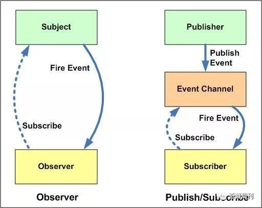

## 观察者模式(observer)

### 概要

定义了对象间一种一对多的依赖关系，当目标对象 Subject 的状态发生改变时，所有依赖它的对象 Observer 都会得到通知。

### 模式特征以及角色

* 一个目标者对象 Subject，拥有方法：添加 / 删除 / 通知 Observer；
* 多个观察者对象 Observer，拥有方法：接收 Subject 状态变更通知并处理；
* 目标对象 Subject 状态变更时，通知所有 Observer。

Subject - 主题
Observer - 观察者


### 示例
```
//观察者队列
const queuedObservers = new Set();
const observe = fn => queuedObservers.add(fn);
function print(){
    console.log(`${person.name},${person.age}`);
}
//将观察者放入队列中
observe(print);
const person = new Proxy({name:'张三',age:22},{
    set(target,key,value,receiver){
        const result = Reflect.set(target,key,value,receiver);
        queuedObservers.forEach(observer => observer());
        return result;
    }
}) 
person.name = '李四';
//李四,22
```

### 优缺点

主题Subject需要一个数组类型来存储所有的订阅者。Subject和Observer之间存在依赖关系，存在耦合。 


## 发布订阅模式（Publisher && Subscriber）

### 概要

基于一个事件（主题）通道，希望接收通知的对象 Subscriber 通过自定义事件订阅主题，被激活事件的对象 Publisher 通过发布主题事件的方式通知各个订阅该主题的 Subscriber 对象。

发布订阅模式与观察者模式的不同，“第三者” （事件中心）出现。目标对象并不直接通知观察者，而是通过事件中心来派发通知。

### 优缺点

优点：解耦更好，细粒度更容易掌控；
缺点：不易阅读，额外对象创建，消耗时间和内存

完全解耦，发布者和订阅者彼此不知道对方的存在


## 两种模式的关联和区别


发布订阅模式更灵活，是进阶版的观察者模式，指定对应分发。

* 观察者模式维护单一事件对应多个依赖该事件的对象关系；
* 发布订阅维护多个事件（主题）及依赖各事件（主题）的对象之间的关系；
* 观察者模式是目标对象直接触发通知（全部通知），观察对象被迫接收通知。发布订阅模式多了个中间层（事件中心），由其去管理通知广播（只通知订阅对应事件的对象）；
* Observer模式，观察者是知道Subject主题的，目标主题一直保持对观察者的记录，而publish-subscribe模式中，订阅者和发布者互相不知道对方，通过消息代理进行通信；
* 观察者模式对象间依赖关系较强，发布订阅模式中对象之间实现真正的解耦。


